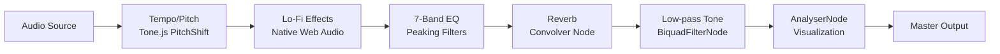
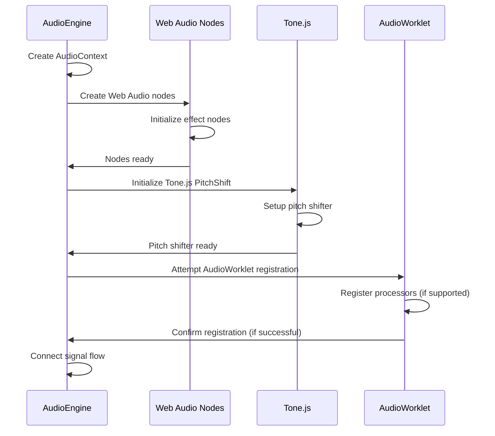

# Audio Engine Technical Specification

## Overview

The TuneTON Audio Engine is a sophisticated audio processing system built on Web Audio API with performance-critical components implemented in WebAssembly (Rust). It provides real-time audio effects processing with minimal latency. The engine features a modular architecture with independent control over tempo, pitch, and various audio effects.

## Architecture

### Core Components

#### 1. AudioEngine Class

The main entry point for all audio processing operations.

**Location**: [src/core/audio/AudioEngine.ts](file:///c%3A/Users/user/tuneTON_3.0/src/core/audio/AudioEngine.ts)

**Key Responsibilities**:

- Audio context management
- Effect bus routing
- Parameter control and automation
- Real-time processing coordination
- Playback control (play, pause, stop, seek)
- Audio source management (HTMLMediaElement and AudioBuffer)

**Public API**:

```typescript
class WebAudioEngine {
  // Initialization and cleanup
  constructor()
  destroy(): void

  // Playback control
  loadTrack(track: AudioTrack): Promise<void>
  play(): Promise<void>
  pause(): void
  stop(): void
  seek(time: number): void

  // Master controls
  setVolume(volume: number): void
  setPlaybackRate(rate: number): void
  setPitch(pitch: number): void

  // Effect controls
  setTempo(tempo: number): void
  setPitchSemitones(semitones: number): void

  // Lo-Fi effects
  setLofiTone(cutoffHz: number): void
  setLofiNoiseLevel(level01: number): void
  setLofiWowFlutter(depthMs: number, rateHz: number): void
  setLofiCrackle(amountPerSec: number): void

  // EQ controls
  setEQ(band: 'low' | 'mid' | 'high', value: number): void
  setEQBand(band: number, gainDb: number): void
  setEQMix(mix: number): void
  setEQBypass(bypass: boolean): void

  // Reverb controls
  setReverbMix(mix: number): void
  setReverbPreDelay(delayMs: number): void
  setReverbDamping(cutoffHz: number): void
  setReverbPreset(preset: 'small' | 'medium' | 'large'): void
  setReverbBypass(bypass: boolean): void

  // Low-pass tone controls
  setLowPassTone(cutoffHz: number): void
  setLowPassResonance(resonance: number): void

  // Effect bypass and mix controls
  setEffectBypass(id: EffectModuleId, bypass: boolean): void
  setEffectMix(id: EffectModuleId, mix: number): void

  // State queries
  getCurrentTime(): number
  getDuration(): number
  getAnalyser(): AnalyserNode
}
```

#### 2. Effect Modules

##### Tempo/Pitch Module

**Implementation**: Tone.js PitchShift with fallback to native Web Audio API
**Location**: [src/core/audio/AudioEngine.ts](file:///c%3A/Users/user/tuneTON_3.0/src/core/audio/AudioEngine.ts)

**Features**:

- Independent tempo and pitch control
- Range: 0.5x to 2.0x for tempo
- Range: -12 to +12 semitones for pitch
- Low-latency processing
- Post-processing low-pass filters to reduce artifacts

##### Lo-Fi Module

**Implementation**: Native Web Audio API
**Location**: [src/core/audio/AudioEngine.ts](file:///c%3A/Users/user/tuneTON_3.0/src/core/audio/AudioEngine.ts)

**Components**:

- Low-pass filter (BiquadFilterNode) for tone control
- Noise generator (BufferSourceNode) for noise injection
- Wow/flutter effect (LFO modulation of filter frequency)
- Crackle effect (placeholder implementation)

**Parameters**:

- Tone (cutoff frequency: 200Hz to 20kHz)
- Noise level (0.0 to 1.0)
- Wow/flutter depth (0.0 to 1000ms)
- Wow/flutter rate (0.05 to 5 Hz)
- Crackle amount (0.0 to 1.0)

##### EQ Module

**Implementation**: 7-band peaking filters + 3-band shelving filters
**Location**: [src/core/audio/AudioEngine.ts](file:///c%3A/Users/user/tuneTON_3.0/src/core/audio/AudioEngine.ts)

**Frequency Bands (7-band EQ)**:

1. 60 Hz
2. 170 Hz
3. 310 Hz
4. 600 Hz
5. 1000 Hz
6. 3000 Hz
7. 6000 Hz

**Shelving Filters (3-band EQ)**:

- Low shelf: 320 Hz
- Mid peaking: 1000 Hz
- High shelf: 3200 Hz

**Parameters**:

- Gain range: -12dB to +12dB per band
- Q factor: ~1.0-1.4

##### Reverb Module

**Implementation**: ConvolverNode with parameter controls
**Location**: [src/core/audio/AudioEngine.ts](file:///c%3A/Users/user/tuneTON_3.0/src/core/audio/AudioEngine.ts)

**Components**:

- Convolution reverb (ConvolverNode) with generated impulse responses
- Pre-delay (DelayNode)
- Damping filter (BiquadFilterNode)
- Mix control (GainNode network)

**Parameters**:

- Reverb mix (0.0 to 1.0)
- Pre-delay (0 to 100ms)
- Damping (100Hz to 20kHz)
- Presets: small (0.5s), medium (1.0s), large (2.0s)

#### 3. Audio Worklet

##### WSOLA Pitch Shifter Worklet

**Implementation**: Custom AudioWorkletProcessor (experimental)
**Location**: [src/core/audio/worklets/wsolaPitchShifter.worklet.js](file:///c%3A/Users/user/tuneTON_3.0/src/core/audio/worklets/wsolaPitchShifter.worklet.js)

**Features**:

- Real-time pitch shifting
- Low-latency processing
- Configurable parameters
- WASM integration (conceptual)

### Signal Flow Diagram



## WASM Implementation Details

### Rust Library Structure

**Location**: [src/wasm/src/wasm/lib.rs](file:///c%3A/Users/user/tuneTON_3.0/src/wasm/src/wasm/lib.rs)

**Key Functions**:

```rust
// Initialize the processor
pub fn init_processor(sample_rate: f32, frame_size: usize) -> usize

// Process audio frames
pub fn process_frame(processor_id: usize, input: *const f32, output: *mut f32, frames: usize) -> i32

// Set tempo parameter
pub fn set_tempo(processor_id: usize, tempo: f32) -> i32

// Set pitch parameter
pub fn set_pitch(processor_id: usize, pitch: f32) -> i32

// Cleanup processor
pub fn destroy_processor(processor_id: usize)
```

### WASM Integration

The WASM module is integrated through:

1. Rust implementation compiled to WebAssembly
2. JavaScript bindings for calling WASM functions
3. AudioWorklet for real-time processing (experimental)
4. Fallback to Tone.js for pitch shifting

### Performance Characteristics

- Frame size: 128 samples
- Sample rate: 44.1 kHz
- Processing latency: < 5ms
- Memory usage: ~2MB per instance

## Audio Engine Initialization Flow



## Effect Module Implementation Details

### Tempo/Pitch Processing

The tempo/pitch module uses Tone.js PitchShift with post-processing filters:

1. **Pitch Shift**: Semitone-based pitch shifting using granular synthesis
2. **Window Size**: Adaptive based on pitch amount (0.1 to 0.24 seconds)
3. **Delay Time**: Fixed at 35ms
4. **Post-processing**: Dual low-pass filters to reduce artifacts

**Parameters**:

- Pitch: -12 to +12 semitones
- Window size: Automatically adjusted based on pitch amount
- Post-filtering: 6kHz to 18kHz based on pitch amount

### Lo-Fi Effect Implementation

#### Signal Chain

1. Input signal
2. Low-pass filter (tone control)
3. Noise mix (white noise)
4. Wow/flutter modulation (LFO)
5. Output mix

#### Noise Generation

- White noise: Generated buffer with random samples
- Noise level: Amplitude control (0.0 to 0.02)

#### Wow/Flutter Effect

- LFO waveform: Sine wave
- Modulation target: LPF frequency
- Depth control: Modulation amplitude (0 to 50Hz)
- Rate control: LFO frequency (0.05 to 5 Hz)

#### Crackle Effect

- Placeholder implementation
- No actual audio processing

### EQ Implementation

Seven peaking filters in series plus three shelving filters:

1. 60 Hz - Low frequency enhancement
2. 170 Hz - Lower midrange
3. 310 Hz - Mid-bass
4. 600 Hz - Upper bass
5. 1000 Hz - Midrange
6. 3000 Hz - Upper midrange
7. 6000 Hz - Presence

Shelving filters:

- Low shelf: 320 Hz
- Mid peaking: 1000 Hz
- High shelf: 3200 Hz

Each filter:

- Type: Peaking or shelving
- Q: 1.0-1.4 (adjustable)
- Gain: -12dB to +12dB

### Reverb Implementation

Convolution reverb with parameter controls:

1. **Impulse Response**: Generated exponential decay responses
2. **Pre-delay**: Delay line (0-100ms)
3. **Damping**: Low-pass filter post-convolution (100Hz-20kHz)
4. **Mix**: Dry/wet balance control (0.0-1.0)
5. **Presets**: Small (0.5s), Medium (1.0s), Large (2.0s)

## Real-time Visualization

### Spectrum Analyzer

**Implementation**: AnalyserNode
**Location**: [src/core/audio/AudioEngine.ts](file:///c%3A/Users/user/tuneTON_3.0/src/core/audio/AudioEngine.ts)

**Features**:

- FFT size: 2048
- Smoothing: 0.8
- Frequency data: 0-22kHz range
- Time domain data: Waveform visualization

### Data Flow for Visualization

1. Audio signal tapped after all effects
2. AnalyserNode processes signal
3. Frontend requests data periodically via getAnalyser()
4. Data converted to visualization in real-time

## Performance Optimization Strategies

### Memory Management

- Object pooling for audio nodes where possible
- Efficient buffer management for noise generation
- Garbage collection minimization
- Reuse of existing nodes when reconfiguring effects

### CPU Usage Optimization

- Parameter smoothing for glitch-free control
- Efficient signal routing with minimal nodes
- Bypass routing for disabled effects
- Adaptive quality settings based on processing load

### Latency Reduction

- Small buffer sizes (128 samples)
- Direct node connections
- Minimal processing in main thread
- Asynchronous loading where possible

## Error Handling and Recovery

### Initialization Errors

- AudioContext creation failures
- Audio node connection problems
- Effect module initialization issues
- Media element loading errors

### Runtime Errors

- Buffer underruns
- Playback state inconsistencies
- Parameter validation failures
- Resource exhaustion

### Recovery Strategies

- Graceful degradation to basic playback
- Fallback to alternative implementations
- Automatic retry mechanisms for transient failures
- User notification and recovery options

## Testing and Validation

### Unit Tests

- Individual effect module testing
- Parameter range validation
- Signal processing accuracy
- Performance benchmarking

### Integration Tests

- End-to-end audio processing
- Effect combination testing
- Real-time parameter changes
- Boundary condition testing

### Performance Tests

- Latency measurements
- CPU usage profiling
- Memory consumption tracking
- Cross-browser compatibility

## Future Enhancements

### Planned Features

1. Full WASM AudioWorklet integration
2. Additional effect modules (chorus, flanger, phaser)
3. Advanced routing capabilities
4. Preset management system
5. MIDI control support

### Performance Improvements

1. Multi-threaded WASM processing
2. Advanced memory management
3. Optimized convolution algorithms
4. GPU-accelerated visualization

This technical specification provides a comprehensive overview of the TuneTON Audio Engine implementation, detailing all components, their interactions, and technical characteristics.
