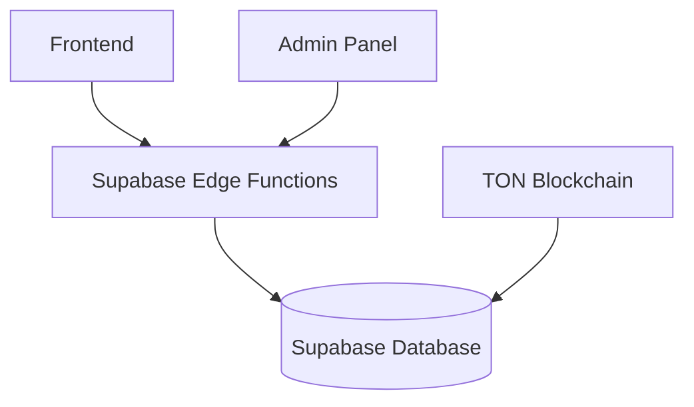
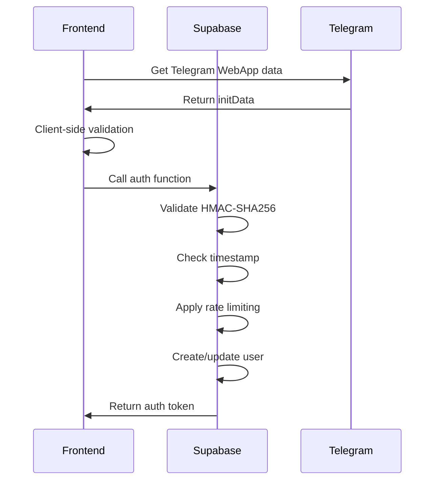
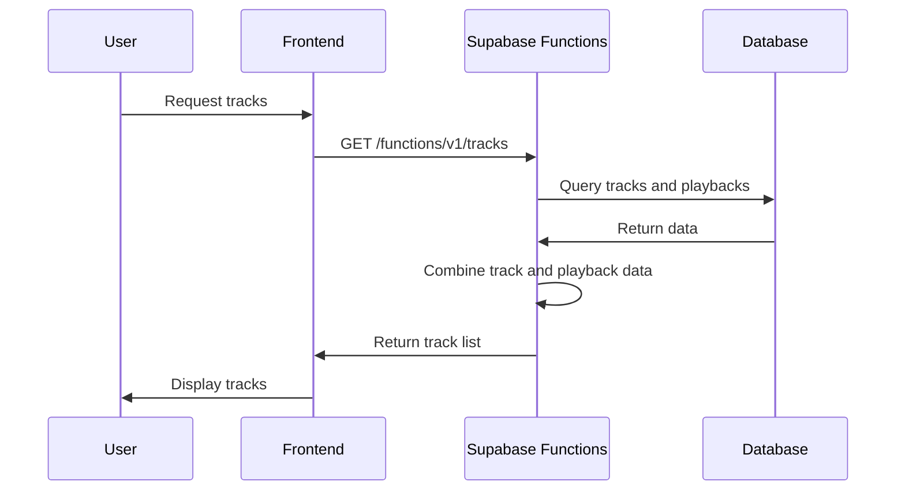
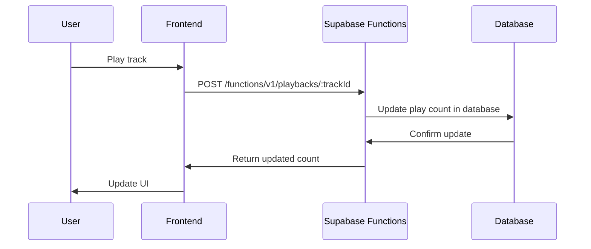
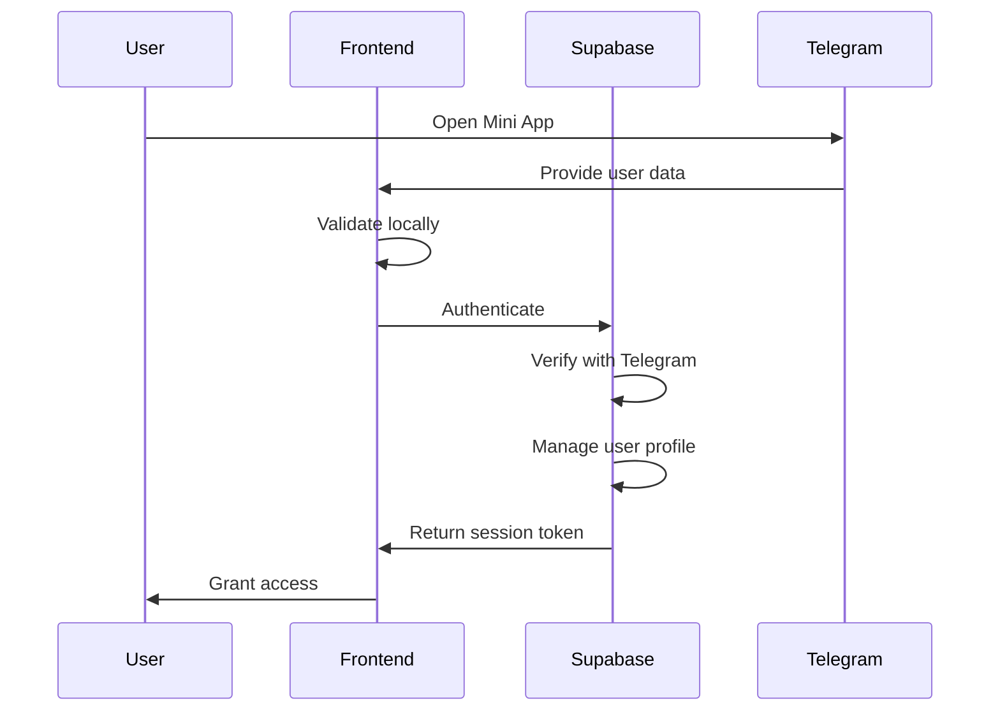

# Backend Services Architecture

## Overview

The TuneTON backend has been migrated to a serverless architecture using Supabase Functions, which provides better scalability, reduced operational complexity, and aligns with the serverless nature of Telegram applications. The architecture now consists of serverless functions for API endpoints, with Supabase for authentication and database management.

## Service Architecture Diagram



## Serverless Functions Architecture

### Service Details

- **Technology**: Supabase Edge Functions (Deno-based)
- **Location**: [supabase/functions/](file:///c%3A/Users/user/tuneTON_3.0/supabase/functions/) directory
- **Purpose**: Serverless API endpoints for track management and playback tracking

### API Endpoints

#### Track Management

```
GET /functions/v1/tracks
- Description: Retrieve list of available tracks
- Response: Array of track objects
- Authentication: None required

POST /functions/v1/playbacks/{trackId}
- Description: Record track playback
- Parameters:
  - trackId: Track ID
- Response: Updated play count
- Authentication: None required

GET /functions/v1/health
- Description: Health check endpoint
- Response: Status information
- Authentication: None required
```

### Implementation Details

#### Function Structure

Each function is implemented as a Deno-based Edge Function with the following structure:

```typescript
import { serve } from 'https://deno.land/std@0.168.0/http/server.ts'
import { createClient } from 'https://esm.sh/@supabase/supabase-js@2'

serve(async (req) => {
  // Handle CORS preflight
  if (req.method === 'OPTIONS') {
    return handleOptions();
  }

  // Function logic
  // ...
});
```

#### Tracks Function

Location: [supabase/functions/tracks/index.ts](file:///c%3A/Users/user/tuneTON_3.0/supabase/functions/tracks/index.ts)

The tracks function retrieves track metadata from the database and returns it to the frontend:

- Fetches tracks from the `tracks` database table
- Retrieves playback counts from the `playbacks` table
- Combines data and returns JSON response
- Implements caching headers for CDN optimization

#### Playbacks Function

Location: [supabase/functions/playbacks/index.ts](file:///c%3A/Users/user/tuneTON_3.0/supabase/functions/playbacks/index.ts)

The playbacks function records track playback events:

- Increments playback count for a specific track
- Updates both the `playbacks` and `tracks` tables
- Returns updated play count and total playbacks
- Handles error cases gracefully

#### Health Function

Location: [supabase/functions/health/index.ts](file:///c%3A/Users/user/tuneTON_3.0/supabase/functions/health/index.ts)

The health function provides a simple health check endpoint:

- Returns current timestamp and status
- Used for monitoring and uptime checks
- Minimal resource usage

### Data Persistence

#### Database Schema

- **Tracks Table**: Stores track metadata
- **Playbacks Table**: Stores playback counts
- **Users Table**: User authentication and profile data

#### Data Migration

Existing data from JSON files has been migrated to the database:

- [tracks.json](file:///c%3A/Users/user/tuneTON_3.0/data/tracks.json) → `tracks` table
- [playbacks.json](file:///c%3A/Users/user/tuneTON_3.0/data/playbacks.json) → `playbacks` table

### Caching Strategy

- CDN caching with appropriate cache headers
- Database query optimization
- ETag support for client-side caching

### CORS Configuration

- **Allowed Origins**: All origins (\*)
- **Methods**: GET, POST, OPTIONS
- **Headers**: Content-Type, Authorization
- **Credentials**: Not required for public endpoints

## PHP Backend Service (Legacy)

### Service Details

- **Technology**: PHP 8.x
- **Location**: [public/api/](file:///c%3A/Users/user/tuneTON_3.0/public/api/) directory
- **Purpose**: Legacy API endpoints (to be deprecated)

### API Endpoints

#### Simple Track API

```
GET /api/tracks.php
- Description: Retrieve list of available tracks
- Response: Array of track objects
- Authentication: None required
```

#### Playback Tracking

```
POST /api/playback.php?id=:trackId
- Description: Record track playback
- Parameters:
  - id: Track ID
- Response: Playback confirmation
- Authentication: None required
```

#### Legacy API Router

```
GET/POST /api.php?path=:endpoint
- Description: Simple API router
- Parameters:
  - path: API endpoint (tracks, playbacks/:id)
- Response: JSON data
- Authentication: None required
```

### Implementation Details

#### Track Discovery

The PHP service scans the audio directory to generate track listings:

1. Scans [public/audio/](file:///c%3A/Users/user/tuneTON_3.0/public/audio/) directory
2. Extracts metadata from filenames
3. Generates track objects with IDs and URLs
4. Returns JSON response

#### Key Files

- [tracks.php](file:///c%3A/Users/user/tuneTON_3.0/public/api/tracks.php) - Track listing endpoint
- [playback.php](file:///c%3A/Users/user/tuneTON_3.0/public/api/playback.php) - Playback tracking endpoint
- [api.php](file:///c%3A/Users/user/tuneTON_3.0/public/api.php) - Simple API router

#### Security Considerations

- Input validation for all parameters
- Error handling that doesn't expose internal details
- Proper HTTP headers for security
- Directory traversal protection

## Supabase Service

### Service Details

- **Technology**: Supabase (PostgreSQL + Functions)
- **Location**: [supabase/](file:///c%3A/Users/user/tuneTON_3.0/supabase/) directory
- **Purpose**: User authentication, database management, and serverless functions

### Functions

#### Telegram Authentication

```
Function: telegram-auth
Location: supabase/functions/telegram-auth/index.ts
Purpose: Secure Telegram WebApp authentication
```

**Features**:

- HMAC-SHA256 data verification
- Timestamp validation (1-hour limit)
- Rate limiting (10 requests per 15 minutes per IP)
- User profile management
- Comprehensive logging

**Implementation Details**:

- Server-side verification matching client-side
- Rate limiting with in-memory store
- User creation/update on authentication
- Detailed error logging

#### Tracks API

```
Function: tracks
Location: supabase/functions/tracks/index.ts
Purpose: Retrieve track metadata
```

**Features**:

- Database query optimization
- Playback count integration
- CDN caching support
- CORS handling

#### Playbacks API

```
Function: playbacks
Location: supabase/functions/playbacks/index.ts
Purpose: Record track playback events
```

**Features**:

- Atomic increment operations
- Dual table updates (playbacks and tracks)
- Error handling and rollback
- Total playbacks calculation

#### Health Check

```
Function: health
Location: supabase/functions/health/index.ts
Purpose: Service health monitoring
```

**Features**:

- Simple status response
- Timestamp information
- Minimal resource usage

### Database Schema

#### Users Table

```sql
Table: users
Columns:
- id (UUID, Primary Key)
- telegram_id (TEXT, Unique)
- username (TEXT)
- first_name (TEXT)
- last_name (TEXT)
- photo_url (TEXT)
- auth_date (TIMESTAMP)
- created_at (TIMESTAMP)
- updated_at (TIMESTAMP)
```

#### Tracks Table

```sql
Table: tracks
Columns:
- id (TEXT, Primary Key)
- title (TEXT)
- artist (TEXT)
- duration (INTEGER)
- playCount (INTEGER)
- audioUrl (TEXT)
- created_at (TIMESTAMP)
- updated_at (TIMESTAMP)
```

#### Playbacks Table

```sql
Table: playbacks
Columns:
- id (UUID, Primary Key)
- track_id (TEXT, Foreign Key to tracks.id)
- count (INTEGER)
- created_at (TIMESTAMP)
- updated_at (TIMESTAMP)
```

### Authentication Flow



## Service Communication Patterns

### Frontend to Backend

- REST API calls over HTTPS to Supabase Functions
- JSON request/response format
- CORS-enabled for cross-origin requests
- Token-based authentication where required

### Backend to External Services

- HTTP/HTTPS requests to external services (as needed)
- Supabase client SDK for database operations
- Telegram Bot API for webhook handling

### Inter-Service Communication

- Shared database for data consistency
- Direct HTTP calls between functions when needed
- Environment variables for configuration

## Data Flow Patterns

### Track Discovery Flow



### Playback Tracking Flow



### Authentication Flow



## Scalability Considerations

### Horizontal Scaling

- **Serverless Functions**: Auto-scaling by Supabase platform
- **Database**: PostgreSQL with read replicas
- **Storage**: Supabase storage with CDN

### Performance Optimization

- CDN caching for API responses
- Database indexing for query performance
- Connection pooling for database operations
- Efficient resource utilization

### Load Distribution

- Supabase Edge Network for global distribution
- Rate limiting at function level
- Asynchronous processing for non-critical tasks
- Efficient resource utilization

## Security Architecture

### Data Protection

- HTTPS encryption for all communications
- Environment variable management for secrets
- Input validation at all service boundaries
- Secure token handling

### Authentication Security

- HMAC-SHA256 validation for Telegram data
- Rate limiting for authentication attempts (10 requests per 15 minutes per IP)
- Session management with secure tokens
- Audit logging for security events

### API Security

- CORS configuration to prevent unauthorized access
- Input sanitization to prevent injection attacks
- Rate limiting to prevent abuse
- Error handling that doesn't expose internal details

## Monitoring and Observability

### Logging Strategy

- Structured logging with consistent format
- Log levels (debug, info, warn, error)
- Request tracing with correlation IDs
- Security event logging

### Performance Monitoring

- Response time tracking
- Error rate monitoring
- Resource utilization metrics
- Database query performance

### Health Checks

- Function availability endpoints (/functions/v1/health)
- Dependency health checks
- Automated alerts for failures
- Graceful degradation strategies

## Deployment Architecture

### Development Environment

- Supabase local development setup
- Environment-specific configuration
- Local function testing with Supabase CLI

### Production Environment

- Static file hosting for frontend
- Supabase cloud for database/functions
- CDN for static assets
- Domain configuration for custom domains

### CI/CD Pipeline

- Automated testing for all functions
- Staging environment for validation
- Rollback capabilities
- Zero-downtime deployment

## Migration from Node.js Backend

### Migration Process

1. **Data Migration**: Transfer data from JSON files to database tables
2. **Function Implementation**: Recreate API endpoints as Supabase Functions
3. **Frontend Updates**: Update API URLs to use Supabase Functions
4. **Testing**: Validate all functionality in staging environment
5. **Deployment**: Deploy to production with monitoring

### Benefits of Migration

1. **Reduced Operational Complexity**: No need to manage separate Node.js servers
2. **Better Scalability**: Auto-scaling serverless functions
3. **Cost Efficiency**: Pay-per-use pricing model
4. **Improved Reliability**: Managed infrastructure with built-in redundancy
5. **Simplified Deployment**: Single platform for database and functions

## Future Service Evolution

### Planned Enhancements

1. Additional serverless functions for new features
2. Advanced caching strategies with Redis
3. Enhanced analytics service
4. Improved monitoring and alerting

### Technology Roadmap

1. Implementation of additional serverless functions
2. Advanced database optimization
3. Enhanced security measures
4. Improved developer experience with better tooling

This document provides a comprehensive overview of the TuneTON backend services architecture after migration to serverless functions, detailing all components, their interactions, and technical implementation details.
