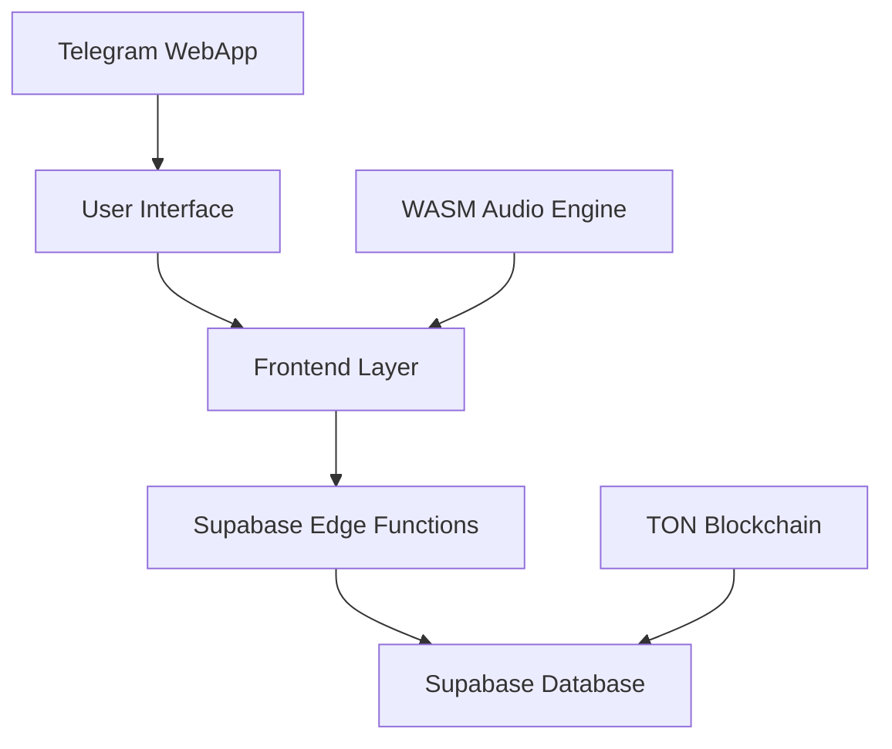
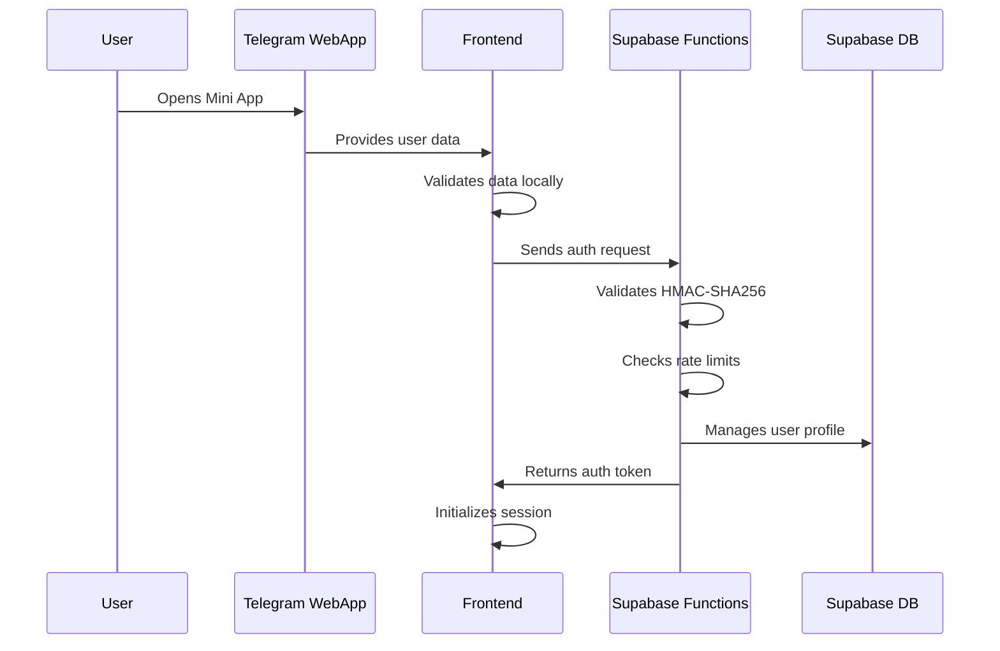
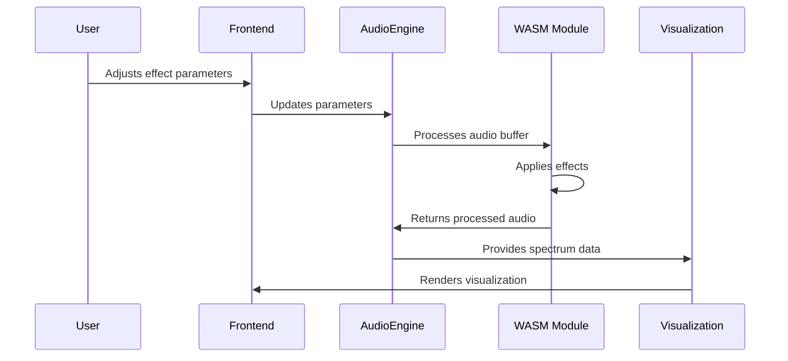

# TuneTON System Architecture

## Overview

TuneTON is a sophisticated music streaming and NFT marketplace built on the TON Blockchain. The system combines advanced audio processing capabilities with Telegram WebApp integration, creating a unique platform for personalized music experiences.

## High-Level Architecture Diagram

## System Components

### 1. Frontend Layer

- **Framework**: React 18 with TypeScript
- **Build Tool**: Vite
- **UI Components**: Radix UI Primitives
- **Styling**: Tailwind CSS
- **State Management**: React Context API
- **Routing**: React Router v6

### 2. Audio Processing Engine

- **Core Engine**: Web Audio API implementation
- **Performance Processing**: WASM (Rust-based)
- **Audio Worklets**: Custom real-time processing
- **Effect Modules**: Tempo/pitch separation, lo-fi, EQ, reverb
- **Real-time Visualization**: Spectrum analyzer with canvas rendering

### 3. Backend Services

- **Serverless Functions**: Supabase Edge Functions (Deno-based)
- **Authentication & Database**: Supabase integration
- **Telegram Integration**: WebApp and Bot API
- **Data Storage**: PostgreSQL database with RLS

### 4. Data Layer

- **Primary Database**: Supabase PostgreSQL
- **External APIs**: None (uses local audio files)
- **Blockchain**: TON integration
- **Static Assets**: File storage system
- **Local Storage**: User preferences and settings

## Component Relationships

### Frontend to Backend Communication

1. REST API calls to Supabase Edge Functions for track management
2. Supabase client for authentication and user data
3. Telegram WebApp SDK for Telegram integration

### Audio Processing Flow

1. User interacts with audio player UI
2. Frontend sends parameters to AudioEngine
3. AudioEngine processes audio through WASM modules
4. Processed audio is rendered in real-time
5. Visualization data is generated and displayed

### Authentication Flow

1. Telegram WebApp initialization
2. User data validation through HMAC-SHA256
3. Supabase authentication function processing
4. Session management in frontend context
5. Protected route access control

## Microservices Architecture

### Audio Service

- **Location**: Frontend WASM modules
- **Responsibilities**: Real-time audio processing
- **Dependencies**: Web Audio API, AudioWorklets
- **Interfaces**: AudioEngine.ts API

### Content Service

- **Location**: Supabase Edge Functions
- **Responsibilities**: Music content retrieval
- **Dependencies**: Database queries
- **Interfaces**: REST API endpoints

### User Service

- **Location**: Supabase functions
- **Responsibilities**: Authentication, user management
- **Dependencies**: Telegram WebApp SDK
- **Interfaces**: Supabase auth API

### Track Management Service

- **Location**: Supabase Edge Functions
- **Responsibilities**: Track metadata, playback tracking
- **Dependencies**: Database
- **Interfaces**: REST API endpoints

## Data Flow Diagrams

### User Authentication Flow

### Audio Processing Flow

## Deployment Architecture

### Development Environment

- Local development with Vite dev server
- Supabase local development setup
- Supabase Edge Functions for API endpoints
- Telegram testing environment

### Production Environment

- Static file hosting for frontend
- Supabase Edge Functions for all backend logic
- Supabase cloud for database/auth
- TON blockchain integration

## Technology Stack Summary

| Layer      | Technology    | Version | Purpose              |
| ---------- | ------------- | ------- | -------------------- |
| Frontend   | React         | 18.x    | UI Framework         |
| Frontend   | TypeScript    | 4.x     | Type Safety          |
| Frontend   | Vite          | 4.x     | Build Tool           |
| Frontend   | Tailwind CSS  | 3.x     | Styling              |
| Frontend   | Radix UI      | 1.x     | Components           |
| Audio      | Web Audio API | Native  | Core Audio           |
| Audio      | WASM/Rust     | 1.70+   | Performance          |
| Backend    | Supabase      | Cloud   | Serverless Functions |
| Database   | PostgreSQL    | 15.x    | Data Storage         |
| Database   | Supabase      | Cloud   | Auth & DB            |
| Blockchain | TON           | Latest  | NFT Marketplace      |
| API        | Telegram      | Latest  | WebApp Integration   |

## Scalability Considerations

### Horizontal Scaling

- Frontend: Static file distribution via CDN
- Backend: Auto-scaling Supabase Edge Functions
- Database: Supabase auto-scaling
- Content: CDN for static assets

### Performance Optimization

- WASM for CPU-intensive audio processing
- Caching strategies for content delivery
- Database indexing for query performance
- CDN for static asset distribution
- Efficient Supabase queries

## Security Architecture

### Data Protection

- HTTPS encryption for all communications
- Environment variable management
- Secure token handling
- Input validation at all layers

### Authentication Security

- HMAC-SHA256 validation for Telegram data
- Rate limiting for authentication attempts (10 requests per 15 minutes per IP)
- Session management with secure tokens
- Protected route implementation
- Comprehensive logging and monitoring

## Monitoring and Observability

### Logging Strategy

- Frontend: Console logging with levels
- Backend: Supabase function logs
- Database: Query logging
- Authentication: Detailed audit trails

### Performance Monitoring

- Frontend: Web vitals tracking
- Backend: Function execution time monitoring
- Database: Query performance metrics
- Audio: Processing latency tracking

## Future Architecture Evolution

### Planned Enhancements

1. Additional serverless functions for new features
2. Advanced caching strategies
3. Enhanced real-time features
4. Full TON blockchain integration for NFT marketplace
5. Mobile application development

### Technology Roadmap

1. Upgrade to latest React features
2. Implement React Server Components
3. Adopt newer WASM features
4. Integrate advanced TON capabilities
5. Enhanced social features and community tools

This document provides a comprehensive overview of the TuneTON system architecture, detailing all components, their relationships, and the overall technical structure of the platform.
