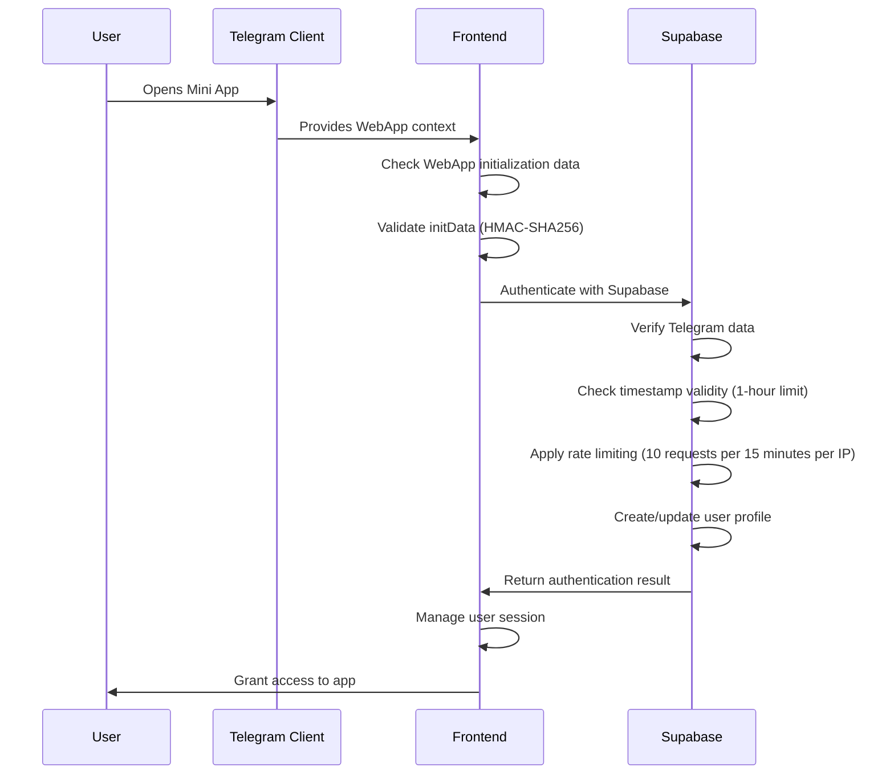

# Telegram Integration Architecture

## Overview

The TuneTON application features comprehensive Telegram WebApp integration that enables users to access the music streaming platform directly within the Telegram client. This integration includes secure authentication, responsive UI design, and seamless user experience optimization for the Telegram environment.

## Telegram WebApp Architecture

### Integration Components

#### 1. Telegram WebApp SDK
- **Library**: [telegram-web-app.js](https://telegram.org/js/telegram-web-app.js?59)
- **Purpose**: Core interface between the app and Telegram client
- **Features**: Theme integration, viewport management, user data access

#### 2. Authentication System
- **Client-side**: HMAC-SHA256 data verification
- **Server-side**: Supabase function with enhanced security
- **Features**: Auto-login, session management, rate limiting

#### 3. UI Adaptation Layer
- **Responsive Design**: Dynamic viewport handling
- **Theme Integration**: Real-time theme parameter adaptation
- **Navigation**: Back button and settings button support

## Authentication Flow

### Detailed Process



### Security Implementation

#### Client-side Validation
**Location**: [src/utils/telegramAuth.ts](file:///c%3A/Users/user/tuneTON_3.0/src/utils/telegramAuth.ts)

**Key Functions**:
```typescript
// Verify Telegram initData using HMAC-SHA256
async function verifyTelegramData(initData: string, botToken: string): Promise<boolean>

// Hash validation with secret key generation
// Timestamp validation to prevent replay attacks (1-hour limit)
// Parameter sorting and data string creation
// Signature comparison
```

#### Server-side Validation
**Location**: [supabase/functions/telegram-auth/index.ts](file:///c%3A/Users/user/tuneTON_3.0/supabase/functions/telegram-auth/index.ts)

**Key Features**:
- Mirrors client-side verification
- Rate limiting (10 requests per 15 minutes per IP)
- User profile management
- Comprehensive logging
- Error handling with user-friendly messages

### Session Management
- Token-based authentication with Supabase
- Automatic session renewal
- Secure storage of session data in localStorage
- Graceful expiration handling with re-authentication

## UI/UX Adaptation

### Viewport Management
**Dynamic Height Handling**:
- Uses `100dvh` for mobile devices
- Adapts to Telegram's viewport changes
- Handles safe area insets for notches

**Viewport Change Events**:
```javascript
// Listen for viewport changes
Telegram.WebApp.onEvent('viewportChanged', () => {
  // Adjust UI layout
  // Update component dimensions
  // Handle orientation changes
});
```

### Theme Integration
**Theme Parameters**:
- Background color (`bg_color`)
- Text color (`text_color`)
- Hint color (`hint_color`)
- Link color (`link_color`)
- Button color (`button_color`)
- Button text color (`button_text_color`)

**Real-time Theme Updates**:
```javascript
// Apply theme colors to UI components
document.documentElement.style.setProperty('--tg-theme-bg-color', themeParams.bg_color);
document.documentElement.style.setProperty('--tg-theme-text-color', themeParams.text_color);
// ... other theme properties
```

### Safe Area Handling
**Insets Management**:
- Top inset (`safe_area_inset_top`)
- Bottom inset (`safe_area_inset_bottom`)
- Left inset (`safe_area_inset_left`)
- Right inset (`safe_area_inset_right`)

**Content Padding**:
```css
/* Apply safe area insets to content */
.content {
  padding-top: var(--tg-safe-area-inset-top);
  padding-bottom: var(--tg-safe-area-inset-bottom);
  padding-left: var(--tg-safe-area-inset-left);
  padding-right: var(--tg-safe-area-inset-right);
}
```

## Component Architecture

### Authentication Components

#### TelegramLoginButton
**Location**: [src/components/TelegramLoginButton.tsx](file:///c%3A/Users/user/tuneTON_3.0/src/components/TelegramLoginButton.tsx)

**Features**:
- Visual integration with Telegram design
- Loading states during authentication
- Error display and recovery options
- Responsive sizing
- Auto-initialization of Telegram WebApp

#### ProtectedRoute
**Location**: [src/components/ProtectedRoute.tsx](file:///c%3A/Users/user/tuneTON_3.0/src/components/ProtectedRoute.tsx)

**Functionality**:
- Route protection based on authentication status
- Redirect logic for unauthenticated users
- Loading states during authentication checks
- Session validation

### Onboarding Components

#### Onboarding Flow
Multiple onboarding components for step-by-step user guidance:
- **OnboardingWelcome.tsx**: Introduction to the app
- **OnboardingWelcomeSlide2.tsx**: Telegram connection explanation
- **OnboardingWelcomeSlide3.tsx**: Authentication flow demonstration
- **OnboardingWelcomeSlide4.tsx**: Feature overview
- **OnboardingGenres.tsx**: Music preference selection
- **OnboardingArtists.tsx**: Artist preference selection

#### Step-by-step Process
1. **Introduction**: App purpose and benefits
2. **Connection**: How Telegram integration works
3. **Authentication**: Secure login process
4. **Preferences**: Music genre and artist selection
5. **Features**: Key app capabilities
6. **Start**: Begin using the app

### Main App Components

#### HomeScreen
**Location**: [src/components/HomeScreen.tsx](file:///c%3A/Users/user/tuneTON_3.0/src/components/HomeScreen.tsx)

**Features**:
- User profile display with Telegram data
- Quick access to main features (player, search, playlists)
- Recent activity tracking
- Personalized recommendations
- Bottom navigation system

#### AudioPlayer
**Location**: [src/components/player/AudioPlayer.tsx](file:///c%3A/Users/user/tuneTON_3.0/src/components/player/AudioPlayer.tsx)

**Telegram-Optimized Features**:
- Compact design for mobile screens
- Large touch targets for controls
- Context-aware theming
- Orientation-responsive layout
- Real-time audio visualization
- Effect controls integration

## API Integration

### Telegram WebApp API Usage

#### User Data Access
```javascript
// Access user information
const user = Telegram.WebApp.initDataUnsafe.user;
const userId = user.id;
const username = user.username;
const firstName = user.first_name;
const lastName = user.last_name;
```

#### Theme Information
```javascript
// Access theme parameters
const theme = Telegram.WebApp.themeParams;
const bgColor = theme.bg_color;
const textColor = theme.text_color;
// ... other theme properties
```

#### Device Information
```javascript
// Access device information
const platform = Telegram.WebApp.platform;
const version = Telegram.WebApp.version;
const isExpanded = Telegram.WebApp.isExpanded;
```

### Event Handling

#### Supported Events
1. **Viewport Changes**: `viewportChanged`
2. **Theme Updates**: `themeChanged`
3. **Back Button**: `backButtonClicked`
4. **Settings Button**: `settingsButtonClicked`
5. **Main Button**: `mainButtonClicked`

#### Event Registration
```javascript
// Register event listeners
Telegram.WebApp.onEvent('viewportChanged', handleViewportChange);
Telegram.WebApp.onEvent('themeChanged', handleThemeChange);
Telegram.WebApp.onEvent('backButtonClicked', handleBackButton);
```

## Performance Optimization

### Loading Strategies
- **Lazy Loading**: Components loaded on demand
- **Code Splitting**: Bundle optimization for faster initial load
- **Caching**: Strategic caching of static assets
- **Preloading**: Critical resources preloaded

### Resource Management
- **Image Optimization**: Responsive images with multiple resolutions
- **Asset Compression**: Gzip/Brotli compression for all assets
- **CDN Distribution**: Global content delivery network
- **Efficient Bundling**: Tree-shaking and minification

### Memory Management
- **Component Cleanup**: Proper unmounting and cleanup
- **Event Listener Management**: Registration and removal
- **State Optimization**: Efficient state management
- **Resource Reuse**: Caching and reuse of expensive operations

## Error Handling and Recovery

### Authentication Errors
- **Invalid Data**: Handling of malformed initData
- **Verification Failures**: HMAC-SHA256 validation errors
- **Network Issues**: Connection problems with Supabase
- **Rate Limiting**: Handling of rate limit exceeded scenarios (10 requests per 15 minutes per IP)

### UI Errors
- **Rendering Issues**: Fallback UI for component failures
- **Layout Problems**: Responsive design error handling
- **Theme Errors**: Default theme application on failures
- **Event Handling**: Graceful degradation of event-driven features

### Recovery Mechanisms
- **Retry Logic**: Automatic retry for transient failures
- **User Guidance**: Clear error messages and recovery steps
- **Fallback Modes**: Reduced functionality modes for critical failures
- **Logging**: Comprehensive error logging for debugging
- **Reset Options**: Clear storage and restart functionality

## Testing Strategy

### Unit Testing
- **Authentication Functions**: verifyTelegramData and related utilities
- **Component Logic**: Individual component functionality
- **State Management**: Context and hook behavior
- **Utility Functions**: Helper functions and calculations

### Integration Testing
- **Authentication Flow**: End-to-end authentication process
- **API Integration**: Telegram WebApp API usage
- **Component Interaction**: Cross-component communication
- **Data Flow**: User data through the system

### User Experience Testing
- **Responsive Design**: Various screen sizes and orientations
- **Theme Adaptation**: Different Telegram themes
- **Performance**: Loading times and interaction responsiveness
- **Accessibility**: Keyboard navigation and screen reader support

## Security Considerations

### Data Validation
- **Input Sanitization**: All user inputs validated
- **Output Encoding**: Proper encoding for display
- **Parameter Validation**: Strict validation of all parameters
- **Error Handling**: Secure error message generation

### Communication Security
- **HTTPS Enforcement**: All communications over secure channels
- **Token Management**: Secure storage and transmission of tokens
- **Data Encryption**: Sensitive data encryption at rest
- **Access Control**: Proper authorization for all operations

### Privacy Protection
- **Data Minimization**: Collection of only necessary data
- **User Consent**: Clear consent for data usage
- **Data Retention**: Defined retention policies
- **Right to Erasure**: Mechanisms for data deletion

## Future Enhancements

### Planned Features
1. **Advanced UI Components**: More Telegram-native UI elements
2. **Enhanced Theming**: Deeper theme integration
3. **Improved Performance**: Further optimization techniques
4. **Advanced Features**: Utilization of more Telegram WebApp APIs
5. **Social Features**: Enhanced community and sharing capabilities
6. **NFT Integration**: Full TON blockchain integration for music NFTs

### Integration Opportunities
1. **Bot API**: Deeper integration with Telegram Bot features
2. **Payments**: Telegram Stars integration for premium features
3. **Cloud Storage**: Utilization of Telegram Cloud Storage
4. **Biometrics**: Integration with device biometric capabilities

This document provides a comprehensive overview of the Telegram integration architecture in TuneTON, detailing all components, their interactions, and technical implementation details.