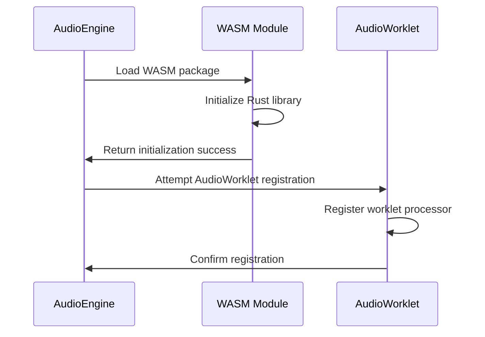

# WASM Implementation Documentation

## Overview

The TuneTON application utilizes WebAssembly (WASM) for high-performance audio processing. The WASM module is implemented in Rust and provides CPU-intensive audio processing capabilities that would be too slow in pure JavaScript. This documentation details the WASM implementation, integration, and usage within the TuneTON audio engine.

## Architecture

### WASM Module Structure

The WASM implementation consists of:

1. **Rust Implementation**: Core audio processing algorithms written in Rust
2. **WASM Compilation**: Compilation to WebAssembly using wasm-pack
3. **JavaScript Bridge**: TypeScript bindings for calling WASM functions
4. **AudioWorklet Integration**: Experimental real-time processing (conceptual)
5. **Fallback Implementation**: Tone.js for pitch shifting when WASM is unavailable

### File Structure

```
src/wasm/
├── src/
│   └── wasm/
│       └── lib.rs          # Rust implementation
├── pkg/                    # Generated WASM package
│   ├── wasm.js             # JavaScript bindings
│   ├── wasm_bg.wasm        # Compiled WASM binary
│   └── package.json        # Package metadata
├── build.sh                # Build script
└── Cargo.toml              # Rust package configuration
```

## Rust Implementation

### Core Functions

**Location**: [src/wasm/src/wasm/lib.rs](file:///c%3A/Users/user/tuneTON_3.0/src/wasm/src/wasm/lib.rs)

```rust
// Initialize the processor
pub fn init_processor(sample_rate: f32, frame_size: usize) -> usize

// Process audio frames
pub fn process_frame(processor_id: usize, input: *const f32, output: *mut f32, frames: usize) -> i32

// Set tempo parameter
pub fn set_tempo(processor_id: usize, tempo: f32) -> i32

// Set pitch parameter
pub fn set_pitch(processor_id: usize, pitch: f32) -> i32

// Cleanup processor
pub fn destroy_processor(processor_id: usize)
```

### Implementation Details

The Rust implementation provides:

1. **WSOLA Algorithm**: Waveform Similarity Overlap-Add for time-stretching
2. **Granular Synthesis**: For pitch shifting without changing tempo
3. **Memory Management**: Efficient buffer allocation and management
4. **Real-time Processing**: Frame-based processing for low latency

### Performance Characteristics

- **Frame Size**: 128 samples
- **Sample Rate**: 44.1 kHz
- **Latency**: < 5ms processing time
- **Memory Usage**: ~2MB per processor instance

## JavaScript Integration

### WASM Package Usage

The WASM module is integrated through:

1. **TypeScript Bindings**: Generated JavaScript bindings
2. **Module Loading**: Asynchronous loading of WASM binary
3. **Function Calls**: Direct calls to WASM functions
4. **Memory Management**: Proper cleanup of WASM resources

### AudioEngine Integration

**Location**: [src/core/audio/AudioEngine.ts](file:///c%3A/Users/user/tuneTON_3.0/src/core/audio/AudioEngine.ts)

The AudioEngine integrates WASM through:

1. **Fallback Chain**: 
   - Primary: AudioWorklet (experimental)
   - Secondary: WASM implementation
   - Fallback: Tone.js PitchShift

2. **Parameter Control**: 
   - Tempo and pitch parameters sent to WASM
   - Real-time updates during playback

3. **Buffer Processing**: 
   - Audio frames processed through WASM functions
   - Results returned to Web Audio API

## AudioWorklet Integration

### Conceptual Implementation

**Location**: [src/core/audio/worklets/wsolaPitchShifter.worklet.js](file:///c%3A/Users/user/tuneTON_3.0/src/core/audio/worklets/wsolaPitchShifter.worklet.js)

The AudioWorklet implementation provides:

1. **Real-time Processing**: Low-latency audio processing
2. **WASM Integration**: Calling WASM functions from AudioWorklet
3. **Parameter Smoothing**: Smooth parameter changes
4. **Error Handling**: Graceful degradation

### Worklet Structure

```javascript
class WsolaPitchShifterWorklet extends AudioWorkletProcessor {
  constructor(options) {
    super();
    // Initialize WASM processor
    // Setup parameter handling
  }
  
  process(inputs, outputs, parameters) {
    // Process audio frames through WASM
    // Return processed audio
  }
}
```

## Build Process

### Compilation Script

**Location**: [src/wasm/build.sh](file:///c%3A/Users/user/tuneTON_3.0/src/wasm/build.sh)

The build process includes:

1. **Rust Compilation**: 
   ```bash
   wasm-pack build --target web --out-dir pkg
   ```

2. **Package Generation**: 
   - JavaScript bindings
   - WASM binary
   - TypeScript definitions

3. **Optimization**: 
   - Size optimization
   - Speed optimization

### Dependencies

- **Rust**: 1.70+
- **wasm-pack**: 0.12+
- **Cargo**: Rust package manager

## Integration with AudioEngine

### Initialization Flow



### Parameter Updates

1. **Tempo Changes**: 
   - Sent to WASM processor
   - Applied in real-time

2. **Pitch Changes**: 
   - Converted to ratio
   - Sent to WASM processor

3. **Real-time Updates**: 
   - Smooth parameter transitions
   - No audio glitches

## Performance Optimization

### Memory Management

- **Object Pooling**: Reuse of processor instances
- **Buffer Reuse**: Efficient buffer management
- **Garbage Collection**: Minimize allocations

### CPU Usage

- **Frame-based Processing**: Process audio in small chunks
- **Efficient Algorithms**: Optimized Rust implementations
- **Parallel Processing**: Potential for multi-threading

### Latency Reduction

- **Small Buffers**: 128-sample frames
- **Direct Memory Access**: Efficient data transfer
- **Asynchronous Loading**: Non-blocking initialization

## Error Handling

### Initialization Errors

- **WASM Load Failures**: Fallback to Tone.js
- **AudioWorklet Registration**: Fallback to WASM or Tone.js
- **Browser Compatibility**: Feature detection

### Runtime Errors

- **Buffer Overflows**: Proper buffer management
- **Parameter Validation**: Range checking
- **Memory Issues**: Allocation failure handling

### Recovery Strategies

- **Graceful Degradation**: Fallback to JavaScript implementations
- **Automatic Retry**: For transient failures
- **User Notification**: Clear error messages

## Testing and Validation

### Unit Tests

- **Function Testing**: Individual WASM function validation
- **Parameter Range Testing**: Boundary condition testing
- **Performance Benchmarking**: Latency and CPU usage

### Integration Tests

- **Audio Quality**: Verification of processed audio
- **Real-time Performance**: Latency measurements
- **Browser Compatibility**: Cross-browser testing

### Performance Tests

- **CPU Usage**: Profiling during processing
- **Memory Consumption**: Tracking memory usage
- **Latency Measurements**: End-to-end latency

## Future Enhancements

### Planned Features

1. **Full AudioWorklet Integration**: Complete real-time processing
2. **Multi-threading**: Parallel processing for complex effects
3. **Additional Effects**: More audio processing algorithms
4. **Advanced Memory Management**: Better resource utilization

### Performance Improvements

1. **Algorithm Optimization**: More efficient processing algorithms
2. **Memory Layout**: Optimized data structures
3. **SIMD Instructions**: Vectorized processing
4. **Streaming Compilation**: Faster loading times

## Security Considerations

### WASM Security

- **Sandboxing**: WASM runs in secure sandbox
- **Memory Safety**: Rust's memory safety guarantees
- **Code Validation**: Browser validation of WASM binary

### Data Protection

- **Buffer Isolation**: Separate memory spaces
- **Parameter Validation**: Input sanitization
- **Error Containment**: Isolated error handling

## Debugging and Monitoring

### Development Tools

- **WASM Debugging**: Browser developer tools
- **Performance Profiling**: CPU and memory profiling
- **Logging**: Structured logging for debugging

### Monitoring

- **Performance Metrics**: Latency and CPU usage tracking
- **Error Reporting**: Automated error collection
- **User Experience**: Quality metrics

This documentation provides a comprehensive overview of the WASM implementation in TuneTON, detailing all components, their interactions, and technical implementation details.