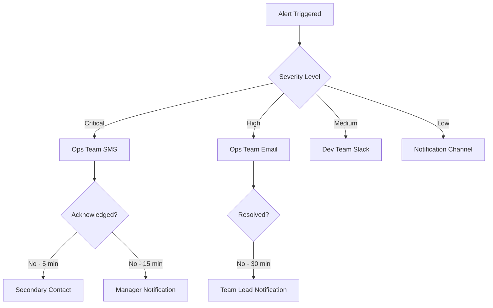
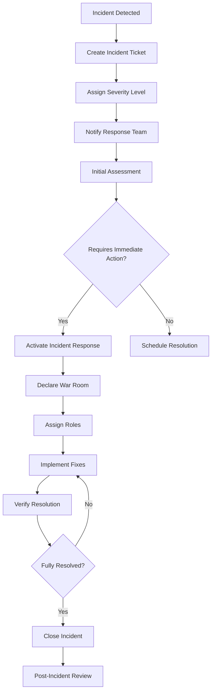
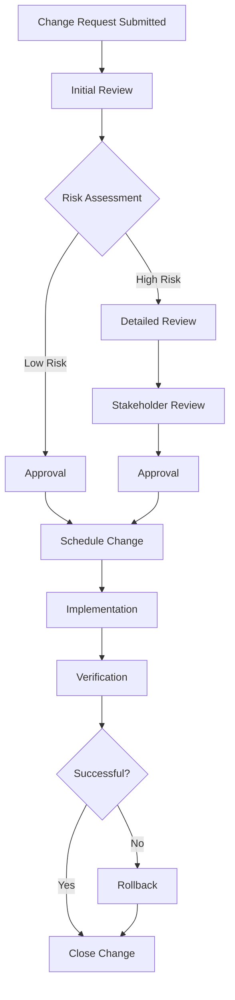

# Operations Manual

## Overview

This document provides comprehensive operational guidance for the TuneTON application, covering monitoring, alerting, incident response, backup and recovery, and day-to-day operational procedures to ensure the platform runs smoothly and reliably.

## System Architecture Overview

### Production Environment

#### Infrastructure Components

```
┌─────────────────────────────────────────────────────────────┐
│                    Load Balancer/CDN                        │
└─────────────────────┬───────────────────────────────────────┘
                      │
        ┌─────────────┼─────────────┐
        │             │             │
┌───────▼──┐   ┌──────▼────┐  ┌─────▼──────┐
│ Frontend │   │ API Layer │  │ WASM Layer │
│ (Static) │   │ (Node.js) │  │  (Rust)    │
└───────┬──┘   └──────┬────┘  └─────┬──────┘
        │             │             │
        └─────────────┼─────────────┘
                      │
              ┌───────▼───────┐
              │   Database    │
              │ (Supabase)    │
              └───────┬───────┘
                      │
            ┌─────────┼─────────┐
            │         │         │
      ┌─────▼──┐ ┌────▼────┐ ┌──▼──┐
      │Jamendo │ │Telegram │ │ TON │
      │  API   │ │   API   │ │Blockchain│
      └────────┘ └─────────┘ └─────┘
```

#### Service Dependencies

1. **Frontend Services**: Static file hosting (AWS S3/CloudFront, Netlify, Vercel)
2. **Backend Services**: Node.js API running on container platform
3. **Database Services**: Supabase PostgreSQL database
4. **Authentication Services**: Supabase authentication functions
5. **Content Services**: Jamendo API for music content
6. **Messaging Services**: Telegram Bot API
7. **Blockchain Services**: TON blockchain integration

## Monitoring and Alerting

### Monitoring Strategy

#### Application Performance Monitoring (APM)

- **Frontend Monitoring**:
  - Page load times
  - JavaScript errors
  - User interaction metrics
  - Core Web Vitals (LCP, FID, CLS)

- **Backend Monitoring**:
  - API response times
  - Database query performance
  - Error rates and patterns
  - Resource utilization (CPU, memory, disk)

- **Infrastructure Monitoring**:
  - Server health metrics
  - Network performance
  - Container resource usage
  - CDN performance

#### Monitoring Tools

- **APM Tool**: New Relic, Datadog, or Prometheus + Grafana
- **Log Management**: ELK Stack (Elasticsearch, Logstash, Kibana)
- **Infrastructure Monitoring**: AWS CloudWatch, Prometheus
- **Uptime Monitoring**: UptimeRobot, Pingdom

### Alerting Configuration

#### Alert Thresholds

##### Frontend Alerts

| Metric                | Warning Threshold | Critical Threshold | Alert Type   |
| --------------------- | ----------------- | ------------------ | ------------ |
| Page Load Time        | > 3s              | > 5s               | Performance  |
| JavaScript Error Rate | > 1%              | > 5%               | Error        |
| API Error Rate        | > 2%              | > 10%              | Error        |
| CDN Availability      | < 99.5%           | < 99%              | Availability |

##### Backend Alerts

| Metric              | Warning Threshold | Critical Threshold | Alert Type  |
| ------------------- | ----------------- | ------------------ | ----------- |
| API Response Time   | > 500ms           | > 1s               | Performance |
| Database Query Time | > 200ms           | > 500ms            | Performance |
| Error Rate          | > 5%              | > 15%              | Error       |
| CPU Usage           | > 70%             | > 90%              | Resource    |
| Memory Usage        | > 75%             | > 95%              | Resource    |

##### Infrastructure Alerts

| Metric              | Warning Threshold | Critical Threshold | Alert Type   |
| ------------------- | ----------------- | ------------------ | ------------ |
| Server Availability | < 99.9%           | < 99.5%            | Availability |
| Disk Space          | < 20% free        | < 10% free         | Resource     |
| Network Latency     | > 100ms           | > 500ms            | Performance  |
| CDN Response Time   | > 200ms           | > 500ms            | Performance  |

#### Alert Channels

- **Critical Alerts**: SMS, Phone call, Slack #critical-alerts
- **High Priority**: Email, Slack #ops-alerts
- **Medium Priority**: Slack #dev-alerts
- **Low Priority**: Slack #notifications

#### Alert Escalation



### Dashboard Configuration

#### Operations Dashboard

- **Real-time Status**: Overall system health
- **Performance Metrics**: Response times, error rates
- **Resource Utilization**: CPU, memory, disk usage
- **Traffic Metrics**: Request rates, user activity
- **Alert Summary**: Active alerts and recent incidents

#### Business Dashboard

- **User Metrics**: Active users, new registrations
- **Usage Metrics**: Track plays, search queries
- **Revenue Metrics**: (if applicable) Premium subscriptions
- **Feature Adoption**: Usage of key features
- **Customer Satisfaction**: Support ticket volume, feedback

## Incident Response

### Incident Management Process

#### Incident Classification

| Severity         | Impact                                | Response Time | Communication                      |
| ---------------- | ------------------------------------- | ------------- | ---------------------------------- |
| SEV-1 (Critical) | System down, data loss                | < 15 min      | Immediate stakeholder notification |
| SEV-2 (High)     | Major functionality broken            | < 1 hour      | Team notification                  |
| SEV-3 (Medium)   | Minor issues, performance degradation | < 4 hours     | Regular updates                    |
| SEV-4 (Low)      | Cosmetic issues, minor bugs           | < 24 hours    | Scheduled fixes                    |

#### Incident Response Workflow



#### Incident Response Roles

##### Incident Commander

- **Responsibilities**:
  - Overall incident coordination
  - Communication with stakeholders
  - Decision-making on critical actions
  - Resource allocation
- **Primary**: Lead DevOps Engineer
- **Secondary**: Tech Lead

##### Technical Lead

- **Responsibilities**:
  - Technical investigation
  - Root cause analysis
  - Solution implementation
  - Code fixes and deployments
- **Primary**: Senior Developer
- **Secondary**: Backend Engineer

##### Communications Lead

- **Responsibilities**:
  - Internal communication
  - External communication (if needed)
  - Status updates
  - Documentation
- **Primary**: Product Manager
- **Secondary**: Customer Support Lead

### Incident Documentation

#### Incident Report Template

```markdown
# Incident Report

## Summary

Brief description of the incident

## Timeline

| Time  | Action                       | Actor             |
| ----- | ---------------------------- | ----------------- |
| 00:00 | Incident detected            | Monitoring System |
| 00:05 | Incident Commander assigned  | Ops Team          |
| 00:15 | Initial assessment completed | Tech Lead         |
| 00:30 | Fix implemented              | Development Team  |
| 00:45 | Service restored             | QA Team           |

## Impact Assessment

- **Affected Users**: Number and percentage
- **Duration**: Start to resolution time
- **Business Impact**: Revenue, user experience impact
- **Data Impact**: Any data loss or corruption

## Root Cause Analysis

- **Immediate Cause**: What directly caused the incident
- **Underlying Cause**: Deeper systemic issues
- **Contributing Factors**: Other factors that worsened the incident

## Resolution

- **Actions Taken**: Specific steps to resolve
- **Verification**: How resolution was confirmed
- **Rollback Plan**: If rollback was needed

## Prevention

- **Immediate Fixes**: Quick fixes to prevent recurrence
- **Long-term Solutions**: Systemic improvements
- **Process Changes**: Updated procedures
```

### Post-Incident Review

#### Retrospective Process

1. **Fact Gathering**: Collect all incident data and logs
2. **Timeline Reconstruction**: Create detailed incident timeline
3. **Root Cause Analysis**: Use 5 Whys or Fishbone diagram
4. **Action Planning**: Define corrective and preventive actions
5. **Documentation**: Update runbooks and procedures
6. **Follow-up**: Track action item completion

#### Blameless Culture

- **Focus on Systems**: Analyze processes and systems, not people
- **Learning Opportunity**: Treat incidents as learning experiences
- **Psychological Safety**: Encourage open discussion
- **Continuous Improvement**: Use findings to improve processes

## Backup and Recovery

### Backup Strategy

#### Data Backup Types

##### Full Backups

- **Frequency**: Weekly
- **Retention**: 4 weeks
- **Storage**: Encrypted cloud storage
- **Verification**: Weekly restore tests

##### Incremental Backups

- **Frequency**: Daily
- **Retention**: 30 days
- **Storage**: Encrypted cloud storage
- **Verification**: Monthly restore tests

##### Transaction Log Backups

- **Frequency**: Every 15 minutes
- **Retention**: 7 days
- **Storage**: High-performance storage
- **Verification**: Continuous monitoring

#### Backup Implementation

##### Database Backups

```bash
#!/bin/bash
# Database backup script
DATE=$(date +%Y%m%d_%H%M%S)
BACKUP_DIR="/backups/database"
RETENTION_DAYS=30

# Create backup
pg_dump -h $DB_HOST -U $DB_USER -d $DB_NAME > $BACKUP_DIR/db_backup_$DATE.sql

# Compress backup
gzip $BACKUP_DIR/db_backup_$DATE.sql

# Encrypt backup
gpg --cipher-algo AES256 --compress-algo 1 --symmetric --output $BACKUP_DIR/db_backup_$DATE.sql.gz.gpg $BACKUP_DIR/db_backup_$DATE.sql.gz

# Remove unencrypted files
rm $BACKUP_DIR/db_backup_$DATE.sql.gz

# Upload to cloud storage
aws s3 cp $BACKUP_DIR/db_backup_$DATE.sql.gz.gpg s3://tuneton-backups/database/

# Cleanup old backups
find $BACKUP_DIR -name "db_backup_*.sql.gz.gpg" -mtime +$RETENTION_DAYS -delete
```

##### Application Backups

```bash
#!/bin/bash
# Application backup script
DATE=$(date +%Y%m%d_%H%M%S)
BACKUP_DIR="/backups/application"
RETENTION_DAYS=7

# Backup application code
tar -czf $BACKUP_DIR/app_backup_$DATE.tar.gz /app/src

# Backup configuration files
tar -czf $BACKUP_DIR/config_backup_$DATE.tar.gz /app/config

# Upload to cloud storage
aws s3 cp $BACKUP_DIR/app_backup_$DATE.tar.gz s3://tuneton-backups/application/
aws s3 cp $BACKUP_DIR/config_backup_$DATE.tar.gz s3://tuneton-backups/application/

# Cleanup old backups
find $BACKUP_DIR -name "app_backup_*.tar.gz" -mtime +$RETENTION_DAYS -delete
find $BACKUP_DIR -name "config_backup_*.tar.gz" -mtime +$RETENTION_DAYS -delete
```

### Recovery Procedures

#### Disaster Recovery Plan

##### Recovery Point Objective (RPO)

- **Database**: 15 minutes
- **Application**: 1 hour
- **User Data**: 15 minutes

##### Recovery Time Objective (RTO)

- **Critical Services**: 2 hours
- **Major Services**: 4 hours
- **Non-Critical Services**: 24 hours

#### Recovery Scenarios

##### Database Recovery

```bash
#!/bin/bash
# Database recovery script
BACKUP_DATE=$1
BACKUP_FILE="db_backup_$BACKUP_DATE.sql.gz.gpg"

# Download backup
aws s3 cp s3://tuneton-backups/database/$BACKUP_FILE /tmp/

# Decrypt backup
gpg --decrypt /tmp/$BACKUP_FILE > /tmp/db_backup_$BACKUP_DATE.sql.gz

# Decompress backup
gunzip /tmp/db_backup_$BACKUP_DATE.sql.gz

# Restore database
psql -h $DB_HOST -U $DB_USER -d $DB_NAME < /tmp/db_backup_$BACKUP_DATE.sql

# Cleanup
rm /tmp/$BACKUP_FILE
rm /tmp/db_backup_$BACKUP_DATE.sql.gz
rm /tmp/db_backup_$BACKUP_DATE.sql
```

##### Application Recovery

```bash
#!/bin/bash
# Application recovery script
BACKUP_DATE=$1

# Download backups
aws s3 cp s3://tuneton-backups/application/app_backup_$BACKUP_DATE.tar.gz /tmp/
aws s3 cp s3://tuneton-backups/application/config_backup_$BACKUP_DATE.tar.gz /tmp/

# Stop application
systemctl stop tuneton-app

# Restore application code
tar -xzf /tmp/app_backup_$BACKUP_DATE.tar.gz -C /
tar -xzf /tmp/config_backup_$BACKUP_DATE.tar.gz -C /

# Start application
systemctl start tuneton-app

# Verify application
curl -f http://localhost:3000/health

# Cleanup
rm /tmp/app_backup_$BACKUP_DATE.tar.gz
rm /tmp/config_backup_$BACKUP_DATE.tar.gz
```

### Backup Verification

#### Automated Testing

- **Weekly Restore Tests**: Automated restore and verification
- **Data Integrity Checks**: Regular data consistency verification
- **Performance Testing**: Verify backup/restore performance
- **Security Testing**: Verify encryption and access controls

#### Manual Verification

- **Monthly Full Restore**: Complete system restore test
- **Quarterly Disaster Simulation**: Full disaster recovery drill
- **Annual Third-Party Audit**: Independent backup verification
- **Regulatory Compliance**: Compliance verification

## Maintenance Procedures

### Scheduled Maintenance

#### Maintenance Windows

- **Primary Window**: Saturday 2:00 AM - 6:00 AM UTC
- **Secondary Window**: Sunday 2:00 AM - 6:00 AM UTC
- **Emergency Maintenance**: As needed with proper notification

#### Maintenance Tasks

##### Weekly Tasks

- **Log Rotation**: Rotate and archive application logs
- **Database Maintenance**: Index optimization, statistics update
- **Security Updates**: Apply security patches to OS and dependencies
- **Backup Verification**: Verify backup integrity

##### Monthly Tasks

- **Database Reindexing**: Full database reindexing
- **Performance Tuning**: Database and application performance tuning
- **Capacity Planning**: Review resource utilization and plan for growth
- **Compliance Audit**: Verify compliance with security standards

##### Quarterly Tasks

- **Disaster Recovery Test**: Full disaster recovery drill
- **Security Assessment**: Comprehensive security assessment
- **Infrastructure Review**: Review and optimize infrastructure
- **Documentation Update**: Update operational documentation

### Maintenance Procedures

#### Pre-Maintenance Checklist

- [ ] Notify stakeholders of maintenance window
- [ ] Verify backup systems are functional
- [ ] Prepare rollback plan
- [ ] Schedule maintenance in change management system
- [ ] Assign maintenance team members
- [ ] Review maintenance procedures

#### Maintenance Execution

1. **Pre-Maintenance**:
   - Final backup
   - Health check
   - Stakeholder notification

2. **Maintenance Execution**:
   - Follow documented procedures
   - Monitor system health
   - Document all changes
   - Test functionality

3. **Post-Maintenance**:
   - Verify system functionality
   - Monitor for issues
   - Update documentation
   - Close maintenance ticket

#### Rollback Procedures

- **Immediate Rollback**: For critical failures during maintenance
- **Graceful Rollback**: For non-critical issues
- **Data Rollback**: Restore from backups if needed
- **Communication**: Notify stakeholders of rollback

### Change Management

#### Change Request Process



#### Change Categories

- **Standard Changes**: Pre-approved, low-risk changes
- **Normal Changes**: Regular changes requiring approval
- **Emergency Changes**: Urgent changes requiring expedited approval

## Capacity Planning

### Resource Monitoring

#### CPU Utilization

- **Current Usage**: Monitor average and peak CPU usage
- **Trend Analysis**: Analyze CPU usage trends
- **Scaling Triggers**: Define auto-scaling thresholds
- **Optimization**: Identify CPU-intensive processes

#### Memory Utilization

- **Current Usage**: Monitor memory allocation and usage
- **Leak Detection**: Identify memory leaks
- **Optimization**: Optimize memory-intensive operations
- **Scaling**: Plan for memory scaling needs

#### Storage Utilization

- **Current Usage**: Monitor disk space usage
- **Growth Trends**: Analyze storage growth patterns
- **Cleanup**: Implement data retention policies
- **Expansion**: Plan for storage expansion

### Performance Tuning

#### Database Optimization

- **Query Optimization**: Analyze and optimize slow queries
- **Index Management**: Create and maintain appropriate indexes
- **Connection Pooling**: Optimize database connections
- **Caching**: Implement database caching strategies

#### Application Optimization

- **Code Profiling**: Identify performance bottlenecks
- **Resource Loading**: Optimize asset loading
- **Caching Strategies**: Implement effective caching
- **Network Optimization**: Optimize network requests

#### Infrastructure Optimization

- **Load Balancing**: Optimize load distribution
- **CDN Configuration**: Optimize content delivery
- **Container Optimization**: Optimize container resource allocation
- **Network Configuration**: Optimize network performance

## Security Operations

### Security Monitoring

#### Threat Detection

- **Intrusion Detection**: Monitor for unauthorized access attempts
- **Anomaly Detection**: Identify unusual activity patterns
- **Vulnerability Scanning**: Regular vulnerability assessments
- **Compliance Monitoring**: Monitor for compliance violations

#### Security Alerts

- **Real-time Alerts**: Immediate notification of security events
- **Investigation Procedures**: Standardized investigation processes
- **Incident Response**: Integration with incident response procedures
- **Reporting**: Regular security reporting

### Access Management

#### User Access Review

- **Periodic Reviews**: Quarterly access reviews
- **Role-Based Access**: Maintain role-based access controls
- **Privileged Access**: Monitor and control privileged access
- **Access Logging**: Log all access attempts

#### Authentication Management

- **Multi-Factor Authentication**: Enforce MFA for critical systems
- **Password Policies**: Enforce strong password policies
- **Session Management**: Monitor and manage user sessions
- **Account Lockout**: Implement account lockout policies

## Compliance Operations

### Audit Preparation

#### Audit Readiness

- **Documentation**: Maintain up-to-date operational documentation
- **Evidence Collection**: Collect and organize audit evidence
- **Process Verification**: Verify compliance with procedures
- **Stakeholder Communication**: Communicate audit requirements

#### Audit Support

- **Auditor Access**: Provide appropriate access to auditors
- **Question Response**: Respond to auditor questions
- **Finding Resolution**: Address audit findings
- **Follow-up**: Implement audit recommendations

### Regulatory Compliance

#### GDPR Compliance

- **Data Processing**: Monitor data processing activities
- **Data Subject Rights**: Handle data subject requests
- **Breach Notification**: Implement breach notification procedures
- **Privacy Impact**: Conduct privacy impact assessments

#### CCPA Compliance

- **Consumer Rights**: Handle consumer rights requests
- **Data Sale**: Monitor and control data sale activities
- **Opt-out Requests**: Process opt-out requests
- **Compliance Reporting**: Regular compliance reporting

This operations manual provides comprehensive guidance for the day-to-day operation, monitoring, and maintenance of the TuneTON application, ensuring reliable and secure delivery of services to users.
