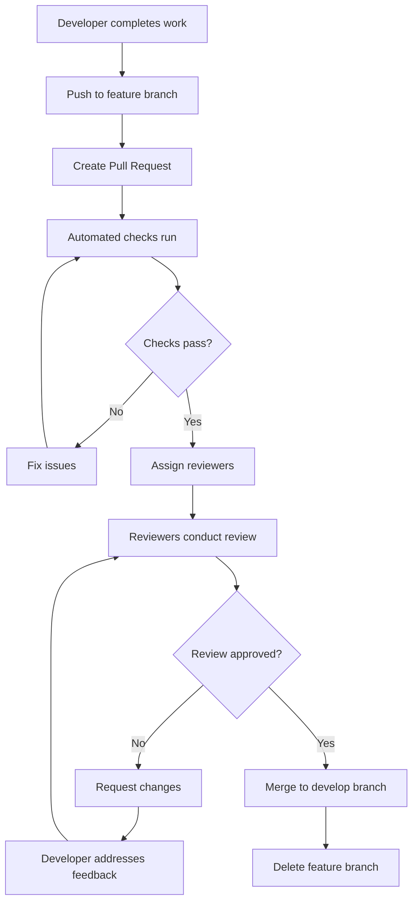
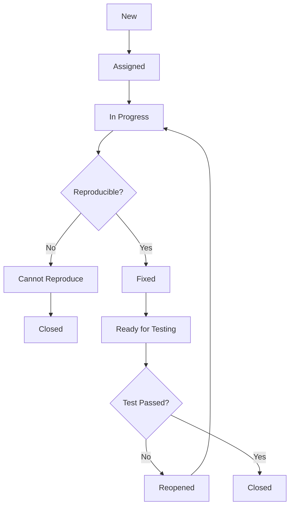
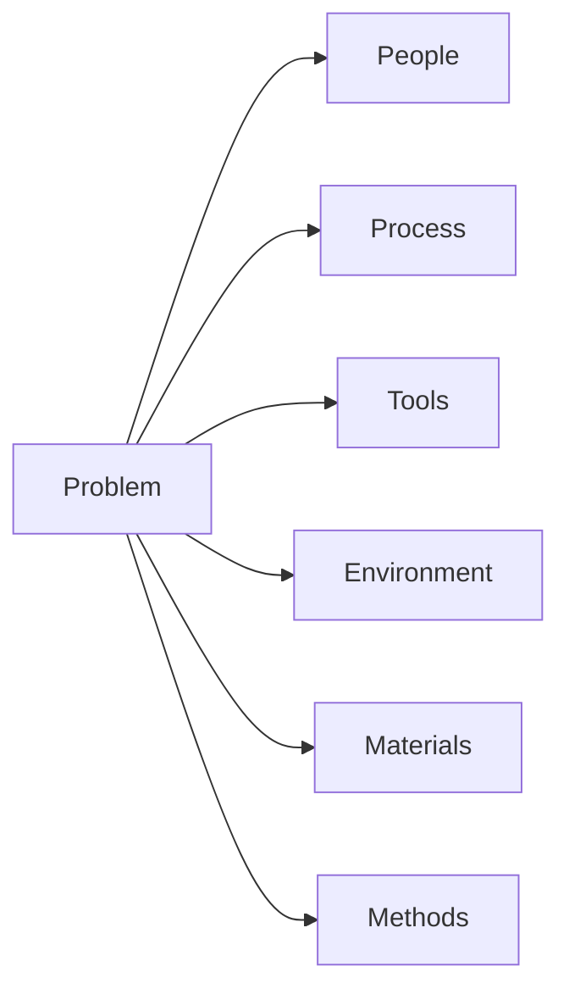

# Quality Assurance Documentation

## Overview

This document outlines the comprehensive Quality Assurance (QA) processes and procedures for the TuneTON application. It covers quality standards, review processes, defect management, and continuous improvement practices to ensure the delivery of a high-quality product that meets user expectations and business requirements.

## Quality Standards

### Code Quality Standards

#### Coding Standards

- **Language-Specific Guidelines**:
  - TypeScript: Follow TypeScript coding standards and best practices
  - Rust: Adhere to Rust programming best practices
  - PHP: Follow PSR-12 coding standards
- **Naming Conventions**: Consistent and descriptive naming for variables, functions, and components
- **Code Structure**: Modular, well-organized code with clear separation of concerns
- **Documentation**: Inline comments for complex logic and JSDoc/TSDoc for public APIs

#### Code Review Standards

```markdown
## Code Review Checklist

### General

- [ ] Code follows established coding standards
- [ ] Naming conventions are consistent and descriptive
- [ ] Code is well-structured and organized
- [ ] Appropriate comments and documentation are included
- [ ] No commented-out code or debug statements

### Functionality

- [ ] Code implements requirements correctly
- [ ] Edge cases are handled appropriately
- [ ] Error handling is comprehensive
- [ ] Performance considerations are addressed
- [ ] Security best practices are followed

### Testing

- [ ] Adequate unit test coverage
- [ ] Integration tests for key functionality
- [ ] Test cases cover happy path and edge cases
- [ ] Tests are clear and maintainable
- [ ] No failing tests

### Maintainability

- [ ] Code is easy to understand and modify
- [ ] Duplicated code is minimized
- [ ] Dependencies are appropriate and up-to-date
- [ ] Code is modular and follows SOLID principles
- [ ] Technical debt is documented where introduced
```

#### Technical Debt Management

- **Identification**: Regular code reviews to identify technical debt
- **Documentation**: Technical debt register with priority and impact assessment
- **Tracking**: Jira tickets for technical debt items
- **Reduction**: Allocate time in sprints for technical debt reduction
- **Prevention**: Prevent introduction of new technical debt

### Performance Standards

#### Response Time Benchmarks

| Component                | Target  | Maximum |
| ------------------------ | ------- | ------- |
| API Response Time        | < 200ms | < 500ms |
| Page Load Time           | < 2s    | < 5s    |
| Audio Processing Latency | < 10ms  | < 50ms  |
| Search Results           | < 500ms | < 1s    |

#### Resource Utilization

- **CPU Usage**: < 70% average, < 90% peak
- **Memory Usage**: < 500MB for frontend, < 1GB for backend
- **Network Bandwidth**: Optimized asset delivery
- **Database Queries**: < 100ms for 95% of queries

#### Scalability Requirements

- **Concurrent Users**: Support 10,000+ concurrent users
- **Request Rate**: Handle 1,000+ requests per second
- **Data Growth**: Accommodate 1TB+ of user data
- **Geographic Distribution**: Global CDN for content delivery

### Security Standards

#### OWASP Compliance

- **Top 10 Implementation**: Protection against all OWASP Top 10 threats
- **Regular Assessments**: Quarterly security assessments
- **Vulnerability Management**: Systematic vulnerability handling
- **Penetration Testing**: Annual penetration testing

#### Data Protection

- **Encryption**: AES-256 encryption for data at rest
- **Transport Security**: TLS 1.3 for all communications
- **Access Control**: Role-based access control with least privilege
- **Audit Logging**: Comprehensive security event logging

#### Privacy Compliance

- **GDPR**: Full GDPR compliance with data subject rights
- **CCPA**: CCPA compliance for California residents
- **Data Minimization**: Collection of only necessary personal data
- **Consent Management**: Clear consent mechanisms

## Review Processes

### Code Review Process

#### Pre-Review Preparation

1. **Self-Review**: Author performs thorough self-review
2. **Test Coverage**: Ensure adequate test coverage
3. **Documentation**: Update relevant documentation
4. **Build Verification**: Verify code builds successfully

#### Review Workflow



#### Review Criteria

- **Functionality**: Code meets requirements and works as expected
- **Quality**: Code follows established standards and best practices
- **Security**: No security vulnerabilities introduced
- **Performance**: No performance degradation
- **Testability**: Code is adequately tested
- **Maintainability**: Code is easy to understand and modify

#### Review Tools

- **GitHub Pull Requests**: Primary review platform
- **Static Analysis**: ESLint, SonarQube for automated checks
- **Security Scanning**: Automated security vulnerability detection
- **Performance Analysis**: Bundle size and performance impact analysis

### Design Review Process

#### Review Participants

- **Product Manager**: Requirements alignment
- **Tech Lead**: Technical feasibility and architecture
- **UX Designer**: User experience and interface design
- **Security Specialist**: Security implications
- **QA Engineer**: Testability considerations

#### Review Agenda

1. **Requirements Review**: Ensure complete understanding of requirements
2. **Architecture Assessment**: Evaluate proposed architecture
3. **Security Analysis**: Identify potential security risks
4. **Performance Considerations**: Assess performance implications
5. **Testability**: Ensure solution is testable
6. **Maintainability**: Evaluate long-term maintainability

#### Review Outcomes

- **Approved**: Proceed with implementation
- **Revisions Required**: Address identified issues
- **Rejected**: Alternative approach needed
- **Deferred**: Insufficient information, postpone decision

### User Acceptance Testing (UAT)

#### UAT Process

1. **Test Plan Creation**: Define test scenarios and acceptance criteria
2. **Environment Setup**: Prepare UAT environment with test data
3. **User Training**: Train users on new functionality
4. **Test Execution**: Execute test scenarios
5. **Defect Reporting**: Log any issues found
6. **Sign-off**: Obtain user acceptance

#### UAT Criteria

- **Functional Completeness**: All requirements implemented
- **Usability**: Intuitive and easy to use
- **Performance**: Meets performance standards
- **Compatibility**: Works across supported platforms
- **Security**: No security vulnerabilities
- **Data Integrity**: Data handled correctly

## Defect Management

### Defect Lifecycle

#### Defect States



#### Defect Prioritization

| Priority | Impact                        | Urgency       | Response Time |
| -------- | ----------------------------- | ------------- | ------------- |
| Critical | System down, data loss        | Immediate     | < 1 hour      |
| High     | Major functionality broken    | Within day    | < 4 hours     |
| Medium   | Minor functionality issues    | Within week   | < 24 hours    |
| Low      | Cosmetic issues, enhancements | When possible | < 72 hours    |

#### Defect Severity Classification

- **Critical**: System crash, data corruption, security breach
- **High**: Major functionality not working, significant performance issues
- **Medium**: Minor functionality issues, usability problems
- **Low**: Cosmetic issues, documentation errors

### Defect Tracking

#### Tracking System

- **Tool**: Jira for defect tracking
- **Fields**: Priority, severity, assignee, status, resolution
- **Workflow**: Standardized defect workflow
- **Reporting**: Regular defect reports and metrics

#### Defect Templates

```markdown
## Defect Report Template

### Summary

Brief description of the defect

### Description

Detailed description of the issue including:

- Steps to reproduce
- Expected behavior
- Actual behavior
- Environment details

### Attachments

- Screenshots
- Error logs
- Test data

### Additional Information

- Related requirements
- Impact assessment
- Workarounds
```

#### Defect Metrics

- **Defect Density**: Defects per 1,000 lines of code
- **Defect Removal Efficiency**: Percentage of defects found before release
- **Mean Time to Resolution**: Average time to fix defects
- **Defect Escape Rate**: Defects found in production

### Root Cause Analysis

#### 5 Whys Technique

1. **Problem Statement**: Clearly define the problem
2. **Why Question 1**: Why did the problem occur?
3. **Why Question 2**: Why did that cause the problem?
4. **Why Question 3**: Why did that happen?
5. **Why Question 4**: Why was that allowed?
6. **Why Question 5**: Why wasn't it prevented?

#### Fishbone Diagram



#### Corrective Actions

- **Immediate Fix**: Address the immediate problem
- **Systemic Fix**: Address root cause
- **Preventive Measures**: Prevent recurrence
- **Process Improvements**: Improve development processes

## Continuous Improvement

### Quality Metrics and KPIs

#### Development Metrics

- **Code Coverage**: >80% unit test coverage
- **Code Review Turnaround**: <24 hours average
- **Build Success Rate**: >95% successful builds
- **Deployment Frequency**: Weekly deployments
- **Lead Time for Changes**: <1 day average

#### Quality Metrics

- **Defect Rate**: <1 defect per 1,000 lines of code
- **Customer Satisfaction**: >4.5/5 rating
- **System Availability**: >99.9% uptime
- **Response Time**: <200ms for 95% of requests
- **Error Rate**: <0.1% error rate

#### Performance Metrics

- **Page Load Time**: <2 seconds average
- **API Response Time**: <200ms average
- **Database Query Time**: <100ms for 95% of queries
- **User Session Duration**: >5 minutes average
- **Feature Adoption Rate**: >70% of users

### Retrospectives and Feedback

#### Sprint Retrospectives

- **Frequency**: At the end of each sprint
- **Participants**: Development team, QA, Product Owner
- **Format**:
  1. What went well?
  2. What didn't go well?
  3. What can we improve?
  4. Action items for next sprint

#### Quality Feedback Loops

- **User Feedback**: Regular user feedback collection
- **Customer Support**: Analysis of support tickets
- **Analytics**: Usage pattern analysis
- **Competitive Analysis**: Benchmark against competitors

#### Process Improvement Initiatives

- **Kaizen Events**: Regular improvement workshops
- **Experimentation**: A/B testing of process changes
- **Training**: Continuous learning and skill development
- **Tooling**: Investment in better QA tools

### Knowledge Management

#### Lessons Learned

- **Documentation**: Document lessons learned from projects
- **Knowledge Base**: Central repository of best practices
- **Sharing Sessions**: Regular knowledge sharing sessions
- **Mentoring**: Experienced developers mentor newcomers

#### Best Practices Repository

- **Coding Standards**: Documented coding best practices
- **Testing Patterns**: Proven testing approaches
- **Security Practices**: Security best practices
- **Performance Optimization**: Performance tuning techniques

#### Continuous Learning

- **Training Programs**: Regular training on new technologies
- **Conference Attendance**: Industry conference participation
- **Certifications**: Relevant professional certifications
- **Research**: Keeping up with industry trends

## QA Tools and Infrastructure

### Automation Tools

#### Test Automation Framework

- **Unit Testing**: Vitest, Jest, Rust testing framework
- **Integration Testing**: Supertest, custom integration tests
- **E2E Testing**: Cypress for web application testing
- **Performance Testing**: k6 for load and performance testing
- **Security Testing**: OWASP ZAP, automated vulnerability scanners

#### CI/CD Integration

```yaml
# .github/workflows/quality.yml
name: Quality Assurance
on: [push, pull_request]

jobs:
  code-quality:
    runs-on: ubuntu-latest
    steps:
      - uses: actions/checkout@v3
      - uses: actions/setup-node@v3
        with:
          node-version: '18'
      - run: npm ci
      - run: npm run lint
      - run: npm run type-check
      - run: npm run format:check

  security-scan:
    runs-on: ubuntu-latest
    steps:
      - uses: actions/checkout@v3
      - uses: actions/setup-node@v3
        with:
          node-version: '18'
      - run: npm ci
      - run: npm audit
      - run: npm run scan:security

  performance-benchmark:
    runs-on: ubuntu-latest
    steps:
      - uses: actions/checkout@v3
      - uses: actions/setup-node@v3
        with:
          node-version: '18'
      - run: npm ci
      - run: npm run test:performance
      - run: npm run benchmark:compare
```

### Monitoring and Analytics

#### Quality Dashboards

- **Real-time Metrics**: Live quality metrics dashboard
- **Trend Analysis**: Historical quality trends
- **Alerting**: Automated alerts for quality issues
- **Reporting**: Regular quality reports

#### User Experience Monitoring

- **Application Performance Monitoring**: Real user monitoring
- **Error Tracking**: Automated error detection and reporting
- **User Feedback**: In-app feedback collection
- **Usage Analytics**: Feature usage tracking

### Test Environment Management

#### Environment Provisioning

- **Infrastructure as Code**: Terraform for environment provisioning
- **Containerization**: Docker for consistent environments
- **Orchestration**: Kubernetes for environment management
- **Automation**: Automated environment setup and teardown

#### Data Management

- **Test Data Generation**: Automated test data creation
- **Data Masking**: PII protection in test environments
- **Data Refresh**: Regular test data refresh
- **Data Archiving**: Historical test data management

## Compliance and Auditing

### Quality Audits

#### Internal Audits

- **Frequency**: Quarterly internal quality audits
- **Scope**: Comprehensive review of QA processes
- **Checklist**: Standardized audit checklist
- **Reporting**: Detailed audit reports with findings

#### External Audits

- **Third-Party Assessments**: Annual third-party quality assessments
- **Certification Audits**: ISO 9001 quality management certification
- **Regulatory Compliance**: GDPR, CCPA compliance audits
- **Industry Standards**: OWASP, NIST compliance assessments

### Process Documentation

#### Standard Operating Procedures

- **Test Planning**: Standardized test planning process
- **Test Execution**: Consistent test execution procedures
- **Defect Management**: Standardized defect handling
- **Release Management**: Quality gates for releases

#### Process Improvement

- **Continuous Process Improvement**: Regular process optimization
- **Benchmarking**: Industry benchmarking
- **Best Practice Adoption**: Implementation of industry best practices
- **Innovation**: Encouragement of quality innovation

This Quality Assurance documentation provides a comprehensive framework for ensuring the delivery of high-quality software that meets user expectations and business requirements through systematic processes, standards, and continuous improvement practices.
