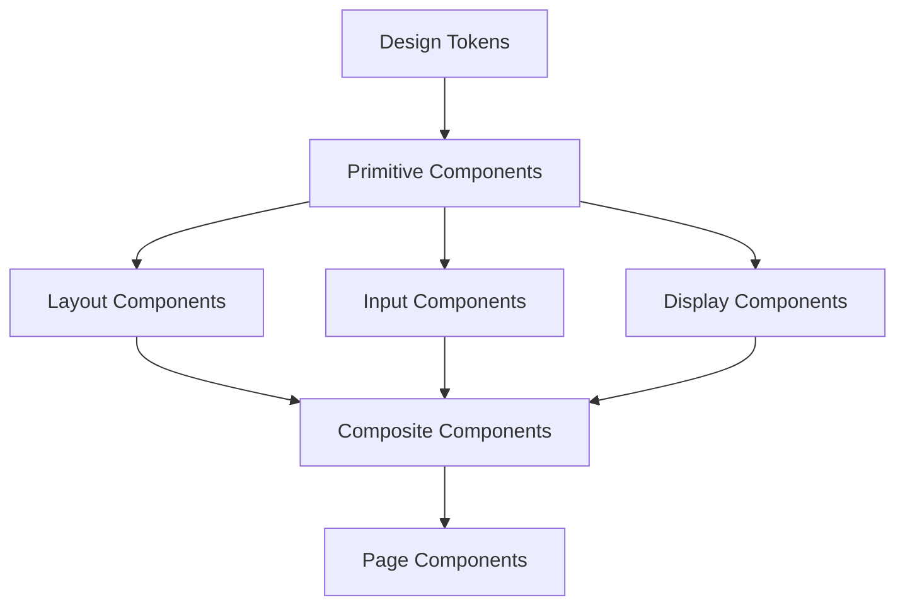

# UI Component Library Documentation

## Overview

This document provides comprehensive documentation for the UI component library used in the TuneTON application. It covers component design principles, implementation guidelines, usage patterns, and best practices to ensure a consistent and high-quality user experience across the platform.

## Design System

### Design Principles

#### Core Principles

1. **Simplicity**: Clean, uncluttered interfaces that prioritize content
2. **Consistency**: Unified visual language and interaction patterns
3. **Accessibility**: Inclusive design that works for all users
4. **Performance**: Fast-loading, responsive components
5. **Mobile-First**: Optimized for mobile with progressive enhancement

#### Visual Design

- **Color Palette**:
  - Primary: #FF6B35 (Orange)
  - Secondary: #2A3D66 (Navy Blue)
  - Accent: #4CAF50 (Green)
  - Neutral: #F5F5F5 (Light Gray), #333333 (Dark Gray)
- **Typography**:
  - Headings: Roboto Bold
  - Body: Roboto Regular
  - Monospace: Roboto Mono
- **Spacing**: 8px base unit with multiples (8, 16, 24, 32, 48, 64)
- **Border Radius**: 4px for buttons, 8px for cards

### Component Hierarchy

#### Foundation Components



## Primitive Components

### Button Component

#### Implementation

```typescript
// src/components/ui/Button.tsx
import React from 'react';
import classNames from 'classnames';

interface ButtonProps extends React.ButtonHTMLAttributes<HTMLButtonElement> {
  variant?: 'primary' | 'secondary' | 'outline' | 'ghost';
  size?: 'sm' | 'md' | 'lg';
  isLoading?: boolean;
  fullWidth?: boolean;
}

export const Button: React.FC<ButtonProps> = ({
  variant = 'primary',
  size = 'md',
  isLoading = false,
  fullWidth = false,
  className,
  children,
  disabled,
  ...props
}) => {
  const buttonClasses = classNames(
    'inline-flex items-center justify-center rounded-md font-medium transition-colors',
    'focus:outline-none focus:ring-2 focus:ring-offset-2',
    {
      // Variants
      'bg-orange-500 hover:bg-orange-600 text-white focus:ring-orange-500': variant === 'primary',
      'bg-navy-600 hover:bg-navy-700 text-white focus:ring-navy-500': variant === 'secondary',
      'border border-gray-300 bg-white hover:bg-gray-50 text-gray-700 focus:ring-orange-500': variant === 'outline',
      'hover:bg-gray-100 text-gray-700 focus:ring-orange-500': variant === 'ghost',

      // Sizes
      'px-3 py-1.5 text-sm': size === 'sm',
      'px-4 py-2 text-sm': size === 'md',
      'px-6 py-3 text-base': size === 'lg',

      // States
      'opacity-50 cursor-not-allowed': disabled || isLoading,
      'w-full': fullWidth,
    },
    className
  );

  return (
    <button
      className={buttonClasses}
      disabled={disabled || isLoading}
      {...props}
    >
      {isLoading && (
        <svg className="animate-spin -ml-1 mr-2 h-4 w-4 text-current" fill="none" viewBox="0 0 24 24">
          <circle className="opacity-25" cx="12" cy="12" r="10" stroke="currentColor" strokeWidth="4"></circle>
          <path className="opacity-75" fill="currentColor" d="M4 12a8 8 0 018-8V0C5.373 0 0 5.373 0 12h4zm2 5.291A7.962 7.962 0 014 12H0c0 3.042 1.135 5.824 3 7.938l3-2.647z"></path>
        </svg>
      )}
      {children}
    </button>
  );
};
```

#### Usage Examples

```typescript
// Primary button
<Button variant="primary">Primary Action</Button>

// Secondary button with loading state
<Button variant="secondary" isLoading>Loading...</Button>

// Outline button, large size
<Button variant="outline" size="lg">Outline Button</Button>

// Full width button
<Button fullWidth>Full Width Button</Button>

// Disabled button
<Button disabled>Disabled Button</Button>
```

#### Accessibility

- **Keyboard Navigation**: Full keyboard operability
- **Focus States**: Visible focus indicators
- **ARIA Labels**: Proper ARIA attributes for screen readers
- **Contrast**: WCAG 2.1 AA compliant color contrast

### Input Component

#### Implementation

```typescript
// src/components/ui/Input.tsx
import React from 'react';
import classNames from 'classnames';

interface InputProps extends React.InputHTMLAttributes<HTMLInputElement> {
  label?: string;
  error?: string;
  helperText?: string;
  fullWidth?: boolean;
}

export const Input: React.FC<InputProps> = ({
  label,
  error,
  helperText,
  fullWidth = false,
  className,
  id,
  ...props
}) => {
  const inputId = id || `input-${Math.random().toString(36).substr(2, 9)}`;

  return (
    <div className={classNames('flex flex-col', { 'w-full': fullWidth })}>
      {label && (
        <label htmlFor={inputId} className="block text-sm font-medium text-gray-700 mb-1">
          {label}
        </label>
      )}

      <input
        id={inputId}
        className={classNames(
          'block w-full rounded-md border-gray-300 shadow-sm',
          'focus:ring-orange-500 focus:border-orange-500',
          'disabled:opacity-50 disabled:cursor-not-allowed',
          {
            'border-red-300 text-red-900 placeholder-red-300 focus:ring-red-500 focus:border-red-500': error,
          },
          className
        )}
        {...props}
      />

      {error && (
        <p className="mt-1 text-sm text-red-600">{error}</p>
      )}

      {helperText && !error && (
        <p className="mt-1 text-sm text-gray-500">{helperText}</p>
      )}
    </div>
  );
};
```

#### Usage Examples

```typescript
// Basic input
<Input placeholder="Enter your name" />

// Input with label
<Input label="Email Address" type="email" placeholder="you@example.com" />

// Input with error state
<Input
  label="Password"
  type="password"
  error="Password must be at least 8 characters"
/>

// Input with helper text
<Input
  label="Username"
  helperText="Use letters, numbers, and underscores only"
/>
```

### Card Component

#### Implementation

```typescript
// src/components/ui/Card.tsx
import React from 'react';
import classNames from 'classnames';

interface CardProps extends React.HTMLAttributes<HTMLDivElement> {
  variant?: 'default' | 'outlined';
  shadow?: 'sm' | 'md' | 'lg';
}

export const Card: React.FC<CardProps> = ({
  variant = 'default',
  shadow = 'md',
  className,
  children,
  ...props
}) => {
  const cardClasses = classNames(
    'rounded-lg',
    {
      // Variants
      'bg-white border border-gray-200': variant === 'default',
      'border border-gray-300 bg-transparent': variant === 'outlined',

      // Shadows
      'shadow-sm': shadow === 'sm',
      'shadow': shadow === 'md',
      'shadow-lg': shadow === 'lg',
    },
    className
  );

  return (
    <div className={cardClasses} {...props}>
      {children}
    </div>
  );
};

interface CardHeaderProps extends React.HTMLAttributes<HTMLDivElement> {
  title?: string;
  subtitle?: string;
}

Card.Header = ({ title, subtitle, className, children, ...props }: CardHeaderProps) => {
  return (
    <div className={classNames('px-6 py-4 border-b border-gray-200', className)} {...props}>
      {title && <h3 className="text-lg font-medium text-gray-900">{title}</h3>}
      {subtitle && <p className="mt-1 text-sm text-gray-500">{subtitle}</p>}
      {children}
    </div>
  );
};

interface CardContentProps extends React.HTMLAttributes<HTMLDivElement> {}

Card.Content = ({ className, children, ...props }: CardContentProps) => {
  return (
    <div className={classNames('px-6 py-4', className)} {...props}>
      {children}
    </div>
  );
};

interface CardFooterProps extends React.HTMLAttributes<HTMLDivElement> {}

Card.Footer = ({ className, children, ...props }: CardFooterProps) => {
  return (
    <div className={classNames('px-6 py-4 bg-gray-50 rounded-b-lg', className)} {...props}>
      {children}
    </div>
  );
};
```

#### Usage Examples

```typescript
// Basic card
<Card>
  <Card.Header title="Card Title" subtitle="Card subtitle" />
  <Card.Content>
    <p>Card content goes here.</p>
  </Card.Content>
  <Card.Footer>
    <Button>Save</Button>
  </Card.Footer>
</Card>

// Outlined card with shadow
<Card variant="outlined" shadow="lg">
  <Card.Content>
    <p>Outlined card content.</p>
  </Card.Content>
</Card>
```

## Layout Components

### Grid System

#### Implementation

```typescript
// src/components/ui/Grid.tsx
import React from 'react';
import classNames from 'classnames';

interface GridProps extends React.HTMLAttributes<HTMLDivElement> {
  columns?: number | 'auto';
  gap?: 'sm' | 'md' | 'lg' | 'xl';
  responsive?: boolean;
}

export const Grid: React.FC<GridProps> = ({
  columns = 'auto',
  gap = 'md',
  responsive = true,
  className,
  children,
  ...props
}) => {
  const gridClasses = classNames(
    {
      // Column definitions
      'grid': true,
      'grid-cols-1 sm:grid-cols-2 md:grid-cols-3 lg:grid-cols-4': columns === 'auto' && responsive,
      'grid-cols-1': columns === 'auto' && !responsive,
      [`grid-cols-${columns}`]: typeof columns === 'number',

      // Gap sizes
      'gap-2': gap === 'sm',
      'gap-4': gap === 'md',
      'gap-6': gap === 'lg',
      'gap-8': gap === 'xl',
    },
    className
  );

  return (
    <div className={gridClasses} {...props}>
      {children}
    </div>
  );
};

interface GridItemProps extends React.HTMLAttributes<HTMLDivElement> {
  span?: number;
}

export const GridItem: React.FC<GridItemProps> = ({
  span,
  className,
  children,
  ...props
}) => {
  const itemClasses = classNames(
    {
      [`col-span-${span}`]: span,
    },
    className
  );

  return (
    <div className={itemClasses} {...props}>
      {children}
    </div>
  );
};
```

#### Usage Examples

```typescript
// Auto-responsive grid
<Grid columns="auto" gap="md">
  <GridItem>
    <Card>Item 1</Card>
  </GridItem>
  <GridItem>
    <Card>Item 2</Card>
  </GridItem>
  <GridItem>
    <Card>Item 3</Card>
  </GridItem>
</Grid>

// Fixed column grid
<Grid columns={3} gap="lg">
  <GridItem span={2}>
    <Card>Wide Item</Card>
  </GridItem>
  <GridItem>
    <Card>Narrow Item</Card>
  </GridItem>
</Grid>
```

### Container Component

#### Implementation

```typescript
// src/components/ui/Container.tsx
import React from 'react';
import classNames from 'classnames';

interface ContainerProps extends React.HTMLAttributes<HTMLDivElement> {
  size?: 'sm' | 'md' | 'lg' | 'xl' | 'full';
  padding?: 'none' | 'sm' | 'md' | 'lg';
}

export const Container: React.FC<ContainerProps> = ({
  size = 'lg',
  padding = 'md',
  className,
  children,
  ...props
}) => {
  const containerClasses = classNames(
    {
      // Sizes
      'max-w-screen-sm mx-auto': size === 'sm',
      'max-w-screen-md mx-auto': size === 'md',
      'max-w-screen-lg mx-auto': size === 'lg',
      'max-w-screen-xl mx-auto': size === 'xl',
      'max-w-full': size === 'full',

      // Padding
      'px-0': padding === 'none',
      'px-4': padding === 'sm',
      'px-6': padding === 'md',
      'px-8': padding === 'lg',
    },
    className
  );

  return (
    <div className={containerClasses} {...props}>
      {children}
    </div>
  );
};
```

#### Usage Examples

```typescript
// Standard container
<Container>
  <h1>Page Content</h1>
</Container>

// Small container with no padding
<Container size="sm" padding="none">
  <p>Compact content</p>
</Container>

// Full-width container
<Container size="full" padding="lg">
  <div className="bg-gray-100 p-8">Full width content</div>
</Container>
```

## Input Components

### Form Component

#### Implementation

```typescript
// src/components/ui/Form.tsx
import React from 'react';
import classNames from 'classnames';

interface FormProps extends React.FormHTMLAttributes<HTMLFormElement> {
  onSubmit: (data: any) => void;
}

export const Form: React.FC<FormProps> = ({ onSubmit, className, children, ...props }) => {
  const handleSubmit = (e: React.FormEvent) => {
    e.preventDefault();
    // Form data handling logic would go here
    // This is a simplified example
    const formData = new FormData(e.target as HTMLFormElement);
    const data = Object.fromEntries(formData.entries());
    onSubmit(data);
  };

  return (
    <form onSubmit={handleSubmit} className={classNames('space-y-6', className)} {...props}>
      {children}
    </form>
  );
};

interface FormFieldProps extends React.HTMLAttributes<HTMLDivElement> {
  label?: string;
  error?: string;
  required?: boolean;
}

Form.Field = ({ label, error, required = false, className, children, ...props }: FormFieldProps) => {
  return (
    <div className={classNames('space-y-1', className)} {...props}>
      {label && (
        <label className="block text-sm font-medium text-gray-700">
          {label} {required && <span className="text-red-500">*</span>}
        </label>
      )}
      {children}
      {error && <p className="text-sm text-red-600">{error}</p>}
    </div>
  );
};

interface FormActionsProps extends React.HTMLAttributes<HTMLDivElement> {
  align?: 'left' | 'center' | 'right';
}

Form.Actions = ({ align = 'left', className, children, ...props }: FormActionsProps) => {
  return (
    <div
      className={classNames(
        'flex',
        {
          'justify-start': align === 'left',
          'justify-center': align === 'center',
          'justify-end': align === 'right',
        },
        className
      )}
      {...props}
    >
      {children}
    </div>
  );
};
```

#### Usage Examples

```typescript
// Basic form
<Form onSubmit={(data) => console.log(data)}>
  <Form.Field label="Name" required>
    <Input name="name" placeholder="Enter your name" />
  </Form.Field>

  <Form.Field label="Email" error="Please enter a valid email">
    <Input name="email" type="email" placeholder="you@example.com" />
  </Form.Field>

  <Form.Actions align="right">
    <Button type="submit">Submit</Button>
  </Form.Actions>
</Form>
```

### Select Component

#### Implementation

```typescript
// src/components/ui/Select.tsx
import React from 'react';
import classNames from 'classnames';

interface SelectOption {
  value: string;
  label: string;
}

interface SelectProps extends React.SelectHTMLAttributes<HTMLSelectElement> {
  label?: string;
  options: SelectOption[];
  error?: string;
  helperText?: string;
}

export const Select: React.FC<SelectProps> = ({
  label,
  options,
  error,
  helperText,
  className,
  id,
  ...props
}) => {
  const selectId = id || `select-${Math.random().toString(36).substr(2, 9)}`;

  return (
    <div className="flex flex-col">
      {label && (
        <label htmlFor={selectId} className="block text-sm font-medium text-gray-700 mb-1">
          {label}
        </label>
      )}

      <select
        id={selectId}
        className={classNames(
          'block w-full rounded-md border-gray-300 shadow-sm',
          'focus:ring-orange-500 focus:border-orange-500',
          'disabled:opacity-50 disabled:cursor-not-allowed',
          {
            'border-red-300 text-red-900 focus:ring-red-500 focus:border-red-500': error,
          },
          className
        )}
        {...props}
      >
        {options.map((option) => (
          <option key={option.value} value={option.value}>
            {option.label}
          </option>
        ))}
      </select>

      {error && (
        <p className="mt-1 text-sm text-red-600">{error}</p>
      )}

      {helperText && !error && (
        <p className="mt-1 text-sm text-gray-500">{helperText}</p>
      )}
    </div>
  );
};
```

#### Usage Examples

```typescript
// Basic select
<Select
  label="Genre"
  options={[
    { value: 'rock', label: 'Rock' },
    { value: 'pop', label: 'Pop' },
    { value: 'jazz', label: 'Jazz' },
  ]}
/>

// Select with error
<Select
  label="Country"
  options={[
    { value: 'us', label: 'United States' },
    { value: 'ca', label: 'Canada' },
    { value: 'uk', label: 'United Kingdom' },
  ]}
  error="Please select a country"
/>
```

## Display Components

### Avatar Component

#### Implementation

```typescript
// src/components/ui/Avatar.tsx
import React from 'react';
import classNames from 'classnames';

interface AvatarProps extends React.ImgHTMLAttributes<HTMLImageElement> {
  size?: 'sm' | 'md' | 'lg' | 'xl';
  fallback?: string;
  alt: string;
}

export const Avatar: React.FC<AvatarProps> = ({
  size = 'md',
  fallback,
  alt,
  className,
  ...props
}) => {
  const sizeClasses = classNames(
    'inline-block rounded-full',
    {
      'h-8 w-8': size === 'sm',
      'h-10 w-10': size === 'md',
      'h-12 w-12': size === 'lg',
      'h-16 w-16': size === 'xl',
    },
    className
  );

  const fallbackClasses = classNames(
    'inline-flex items-center justify-center rounded-full bg-orange-100 text-orange-800 font-medium',
    {
      'h-8 w-8 text-xs': size === 'sm',
      'h-10 w-10 text-sm': size === 'md',
      'h-12 w-12 text-base': size === 'lg',
      'h-16 w-16 text-lg': size === 'xl',
    }
  );

  if (props.src) {
    return (
      
    );
  }

  return (
    <div className={fallbackClasses}>
      {fallback ? fallback.charAt(0).toUpperCase() : '?'}
    </div>
  );
};
```

#### Usage Examples

```typescript
// Avatar with image
<Avatar
  src="https://example.com/avatar.jpg"
  alt="User Name"
  size="lg"
/>

// Avatar with fallback
<Avatar
  fallback="John Doe"
  alt="John Doe"
  size="md"
/>

// Small avatar
<Avatar
  fallback="A"
  alt="User"
  size="sm"
/>
```

### Badge Component

#### Implementation

```typescript
// src/components/ui/Badge.tsx
import React from 'react';
import classNames from 'classnames';

interface BadgeProps extends React.HTMLAttributes<HTMLSpanElement> {
  variant?: 'primary' | 'secondary' | 'success' | 'warning' | 'danger';
  size?: 'sm' | 'md' | 'lg';
}

export const Badge: React.FC<BadgeProps> = ({
  variant = 'primary',
  size = 'md',
  className,
  children,
  ...props
}) => {
  const badgeClasses = classNames(
    'inline-flex items-center rounded-full font-medium',
    {
      // Variants
      'bg-orange-100 text-orange-800': variant === 'primary',
      'bg-navy-100 text-navy-800': variant === 'secondary',
      'bg-green-100 text-green-800': variant === 'success',
      'bg-yellow-100 text-yellow-800': variant === 'warning',
      'bg-red-100 text-red-800': variant === 'danger',

      // Sizes
      'px-2 py-0.5 text-xs': size === 'sm',
      'px-2.5 py-0.5 text-sm': size === 'md',
      'px-3 py-1 text-sm': size === 'lg',
    },
    className
  );

  return (
    <span className={badgeClasses} {...props}>
      {children}
    </span>
  );
};
```

#### Usage Examples

```typescript
// Primary badge
<Badge variant="primary">New</Badge>

// Success badge, large size
<Badge variant="success" size="lg">Completed</Badge>

// Warning badge
<Badge variant="warning">Pending</Badge>

// Danger badge, small size
<Badge variant="danger" size="sm">Error</Badge>
```

## Composite Components

### Audio Player Component

#### Implementation

```typescript
// src/components/player/AudioPlayer.tsx
import React, { useState, useEffect } from 'react';
import { useAudioPlayer } from '../../hooks/useAudioPlayer';
import { Button } from '../ui/Button';
import { Slider } from '../ui/Slider';

interface AudioPlayerProps {
  track: {
    id: string;
    title: string;
    artist: string;
    duration: number;
    coverArt?: string;
  };
}

export const AudioPlayer: React.FC<AudioPlayerProps> = ({ track }) => {
  const {
    isPlaying,
    currentTime,
    duration,
    volume,
    play,
    pause,
    seek,
    setVolume,
  } = useAudioPlayer();

  const formatTime = (seconds: number): string => {
    const mins = Math.floor(seconds / 60);
    const secs = Math.floor(seconds % 60);
    return `${mins}:${secs.toString().padStart(2, '0')}`;
  };

  return (
    <div className="bg-white rounded-lg shadow-md p-4">
      <div className="flex items-center space-x-4">
        {track.coverArt && (
          
        )}

        <div className="flex-1 min-w-0">
          <h3 className="text-lg font-medium text-gray-900 truncate">{track.title}</h3>
          <p className="text-sm text-gray-500 truncate">{track.artist}</p>
        </div>

        <div className="flex items-center space-x-2">
          <Button
            variant="ghost"
            size="sm"
            onClick={isPlaying ? pause : play}
            aria-label={isPlaying ? 'Pause' : 'Play'}
          >
            {isPlaying ? (
              <svg className="h-6 w-6" fill="currentColor" viewBox="0 0 20 20">
                <path fillRule="evenodd" d="M18 10a8 8 0 11-16 0 8 8 0 0116 0zM7 8a1 1 0 012 0v4a1 1 0 11-2 0V8zm5-1a1 1 0 00-1 1v4a1 1 0 102 0V8a1 1 0 00-1-1z" clipRule="evenodd" />
              </svg>
            ) : (
              <svg className="h-6 w-6" fill="currentColor" viewBox="0 0 20 20">
                <path fillRule="evenodd" d="M10 18a8 8 0 100-16 8 8 0 000 16zM9.555 7.168A1 1 0 008 8v4a1 1 0 001.555.832l3-2a1 1 0 000-1.664l-3-2z" clipRule="evenodd" />
              </svg>
            )}
          </Button>
        </div>
      </div>

      <div className="mt-4 space-y-2">
        <Slider
          value={currentTime}
          min={0}
          max={duration}
          onChange={seek}
          aria-label="Seek"
        />

        <div className="flex justify-between text-xs text-gray-500">
          <span>{formatTime(currentTime)}</span>
          <span>{formatTime(duration)}</span>
        </div>
      </div>

      <div className="mt-4 flex items-center space-x-2">
        <svg className="h-5 w-5 text-gray-400" fill="currentColor" viewBox="0 0 20 20">
          <path fillRule="evenodd" d="M9.383 3.076A1 1 0 0110 4v12a1 1 0 01-1.707.707L4.586 13H2a1 1 0 01-1-1V8a1 1 0 011-1h2.586l3.707-3.707a1 1 0 011.09-.217zM14.657 2.929a1 1 0 011.414 0A9.972 9.972 0 0119 10a9.972 9.972 0 01-2.929 7.071 1 1 0 01-1.414-1.414A7.971 7.971 0 0017 10c0-2.21-.894-4.208-2.343-5.657a1 1 0 010-1.414zm-2.829 2.828a1 1 0 011.415 0A5.983 5.983 0 0115 10a5.984 5.984 0 01-1.757 4.243 1 1 0 01-1.415-1.415A3.984 3.984 0 0013 10a3.983 3.983 0 00-1.172-2.828 1 1 0 010-1.415z" clipRule="evenodd" />
        </svg>

        <Slider
          value={volume}
          min={0}
          max={1}
          step={0.01}
          onChange={setVolume}
          aria-label="Volume"
          className="flex-1"
        />
      </div>
    </div>
  );
};
```

### Search Component

#### Implementation

```typescript
// src/components/search/SearchBar.tsx
import React, { useState } from 'react';
import { Input } from '../ui/Input';
import { Button } from '../ui/Button';

interface SearchBarProps {
  onSearch: (query: string) => void;
  placeholder?: string;
  initialValue?: string;
}

export const SearchBar: React.FC<SearchBarProps> = ({
  onSearch,
  placeholder = 'Search tracks, artists, albums...',
  initialValue = '',
}) => {
  const [query, setQuery] = useState(initialValue);

  const handleSubmit = (e: React.FormEvent) => {
    e.preventDefault();
    onSearch(query);
  };

  const handleClear = () => {
    setQuery('');
    onSearch('');
  };

  return (
    <form onSubmit={handleSubmit} className="relative">
      <div className="relative rounded-md shadow-sm">
        <div className="absolute inset-y-0 left-0 pl-3 flex items-center pointer-events-none">
          <svg className="h-5 w-5 text-gray-400" fill="currentColor" viewBox="0 0 20 20">
            <path fillRule="evenodd" d="M8 4a4 4 0 100 8 4 4 0 000-8zM2 8a6 6 0 1110.89 3.476l4.817 4.817a1 1 0 01-1.414 1.414l-4.816-4.816A6 6 0 012 8z" clipRule="evenodd" />
          </svg>
        </div>

        <Input
          type="text"
          value={query}
          onChange={(e) => setQuery(e.target.value)}
          placeholder={placeholder}
          className="block w-full pl-10 pr-10"
        />

        {query && (
          <div className="absolute inset-y-0 right-0 flex items-center">
            <Button
              type="button"
              variant="ghost"
              size="sm"
              onClick={handleClear}
              className="p-1"
              aria-label="Clear search"
            >
              <svg className="h-5 w-5 text-gray-400" fill="currentColor" viewBox="0 0 20 20">
                <path fillRule="evenodd" d="M10 18a8 8 0 100-16 8 8 0 000 16zM8.707 7.293a1 1 0 00-1.414 1.414L8.586 10l-1.293 1.293a1 1 0 101.414 1.414L10 11.414l1.293 1.293a1 1 0 001.414-1.414L11.414 10l1.293-1.293a1 1 0 00-1.414-1.414L10 8.586 8.707 7.293z" clipRule="evenodd" />
              </svg>
            </Button>
          </div>
        )}
      </div>

      <Button type="submit" className="sr-only">
        Search
      </Button>
    </form>
  );
};
```

## Component Testing

### Testing Strategy

#### Unit Testing

```typescript
// src/components/ui/Button.test.tsx
import { render, screen, fireEvent } from '@testing-library/react';
import { Button } from './Button';

describe('Button', () => {
  it('renders with correct text', () => {
    render(<Button>Click me</Button>);
    expect(screen.getByText('Click me')).toBeInTheDocument();
  });

  it('handles click events', () => {
    const handleClick = jest.fn();
    render(<Button onClick={handleClick}>Click me</Button>);

    fireEvent.click(screen.getByText('Click me'));
    expect(handleClick).toHaveBeenCalledTimes(1);
  });

  it('shows loading state', () => {
    render(<Button isLoading>Loading</Button>);

    expect(screen.getByRole('button')).toBeDisabled();
    expect(screen.getByLabelText('Loading')).toBeInTheDocument();
  });

  it('applies correct variants', () => {
    const { container } = render(<Button variant="secondary">Secondary</Button>);
    expect(container.firstChild).toHaveClass('bg-navy-600');
  });

  it('is accessible', () => {
    render(<Button>Accessible Button</Button>);

    const button = screen.getByRole('button');
    expect(button).toHaveAttribute('tabindex', '0');
    expect(button).toHaveFocus();
  });
});
```

#### Integration Testing

```typescript
// src/components/player/AudioPlayer.test.tsx
import { render, screen, fireEvent } from '@testing-library/react';
import { AudioPlayer } from './AudioPlayer';
import { useAudioPlayer } from '../../hooks/useAudioPlayer';

// Mock the hook
jest.mock('../../hooks/useAudioPlayer');

const mockTrack = {
  id: '1',
  title: 'Test Track',
  artist: 'Test Artist',
  duration: 180,
  coverArt: 'https://example.com/cover.jpg',
};

describe('AudioPlayer', () => {
  beforeEach(() => {
    (useAudioPlayer as jest.Mock).mockReturnValue({
      isPlaying: false,
      currentTime: 0,
      duration: 180,
      volume: 0.8,
      play: jest.fn(),
      pause: jest.fn(),
      seek: jest.fn(),
      setVolume: jest.fn(),
    });
  });

  it('renders track information', () => {
    render(<AudioPlayer track={mockTrack} />);

    expect(screen.getByText('Test Track')).toBeInTheDocument();
    expect(screen.getByText('Test Artist')).toBeInTheDocument();
  });

  it('toggles play/pause button', () => {
    const mockPlay = jest.fn();
    (useAudioPlayer as jest.Mock).mockReturnValue({
      ...useAudioPlayer(),
      play: mockPlay,
    });

    render(<AudioPlayer track={mockTrack} />);

    fireEvent.click(screen.getByLabelText('Play'));
    expect(mockPlay).toHaveBeenCalled();
  });

  it('formats time correctly', () => {
    render(<AudioPlayer track={mockTrack} />);

    expect(screen.getByText('0:00')).toBeInTheDocument();
    expect(screen.getByText('3:00')).toBeInTheDocument();
  });
});
```

## Component Documentation Standards

### Documentation Template

#### Component Overview

- **Name**: Component name
- **Description**: Brief description of the component's purpose
- **Import Path**: How to import the component
- **Category**: Component category (Primitive, Layout, Input, Display, Composite)

#### Props

| Prop  | Type    | Default | Description          |
| ----- | ------- | ------- | -------------------- |
| prop1 | string  | ''      | Description of prop1 |
| prop2 | boolean | false   | Description of prop2 |

#### Usage Examples

```typescript
// Example 1
<Component prop1="value" prop2={true} />

// Example 2
<Component>
  <ChildComponent />
</Component>
```

#### Accessibility

- **Keyboard Navigation**: How the component handles keyboard input
- **Screen Reader Support**: ARIA attributes and labels
- **Focus Management**: Focus behavior and indicators
- **Color Contrast**: WCAG compliance information

#### Best Practices

- **When to Use**: Appropriate use cases
- **When Not to Use**: Inappropriate use cases
- **Performance Considerations**: Performance implications
- **Common Pitfalls**: Common mistakes to avoid

This UI component library documentation provides a comprehensive guide to the components used in the TuneTON application, ensuring consistency, accessibility, and maintainability across the platform.
